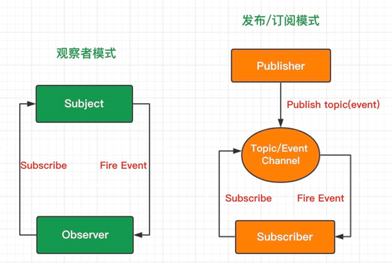

<!--
 * @Author: wangzn
 * @Date: 2021-05-16 20:18:21
 * @LastEditTime: 2021-05-23 21:21:29
 * @LastEditors: wangzn
 * @Description: 
-->
# Vue2.6.x源码阅读 - 7.源码阅读-core-响应式原理

> 数据类型(data、prop、watch、computed)初始化，构建数据双向绑定等相关源码学习。

* 关于响应式原理的基本概念的介绍可见[Vue响应式原理](https://github.com/fff455/tech-share/blob/master/Vue/Vue%E5%93%8D%E5%BA%94%E5%BC%8F%E5%8E%9F%E7%90%86.md)一文。了解基本概念后，继续结合源码对响应式原理展开更深入的了解。

## 观察者模式(Observer pattern) 与 发布-订阅模式(Pub-sub pattern)

* ``观察者模式``为``JavaScript设计模式``中常用的设计模式之一，定义了对象间一对多的依赖关系，当被观察者发生变化时，观察者也会根据依赖关系随之进行更新。形象点来说，被观察者相当于一个视频号，观察者就是关注视频号的人，当视频号更新时，关注人都会收到对应的推送，然后开展其某些行为。这种模式很容易就能联想到``Vue``的数据响应，被订阅的数据发生变化时，最终相应到``view``层的``dom``变化。

* 不过``Vue``的响应式原理并没有仅限于停留在观察者模式。在``观察者模式``的基础上，优化出了一个新的模式，即``发布-订阅模式``。它与前者的区别在于，在发布者(被观察者)与订阅着(观察者)之间，增加了一个调度中心。由调度中心对发布者发布的内容进行统一处理，发送至订阅了该内容的订阅者。订阅者与发布者之间并不存在直接沟通，其沟通是通过第三方的调度中心完成的。再形象点来说，就好比视频号的订阅人与视频号的所有人之间并没有直接联系，而通过视频平台构建两者的关系。

* 两种模式的结构可见下图。摘自[观察者模式和发布订阅模式有什么区别？](https://segmentfault.com/a/1190000018706349)

  

* ``Vue``即采用了``发布订阅模式``来作为``响应式原理``的核心设计模式。回看官方给出的结构图。可以根据源码实现与设计模式的进行一定的转化。转化后图摘自[从发布-订阅模式到Vue响应系统](https://segmentfault.com/a/1190000013338801)

  

  

* ``Observer``部分就是发布者(被订阅者)，``Dep``(Dependency)即调度中心，在原图中合并为了``Data``部分。``Watcher``即订阅者(观察者)，在原图中依旧为``Watcher``。

* 用更``Vue``化的意思来说，整个流程即是通过``Observer``与数据(Data)构建联系，整体作为一个发布者。在数据发生变化时，通过``Dep``通知到``Watcher``，而``Watcher``又与界面元素建立了联系，从而完成了``dom``的更新。

* Dep(调度中心)在``Vue``中主要做了两件事，依赖收集(Collect Dependency)与派发更新(Notify)。即收集来自订阅者的订阅，通知订阅者相关发布者的更新。

## Observer

* 在上述设计模式的解释中，通过图解，已将设计模式转换成了``Vue``源码的实现。在Vue核心源码(core)中，整个``core/observer``目录均为``响应式原理``的实现代码。先整体预览一遍目录内的文件构成。

  - ``array.js`` 创建含有重写数组方法的数组，让所有的响应式数据数组继承自该数组

  - ``dep.js`` Dep Class相关代码

  - ``index.js`` Observer Class相关代码

  - ``scheduler.js`` 任务调度工具，Wathcer执行的核心

  - ``traverse.js`` 递归遍历响应式数据，用于触发依赖收集。

  - ``watcher.js`` Watcher Class相关代码

### array.js

* 该文件的功能，上述也已提到，创建含有重写数组方法的数组，让所有的响应式数据数组继承自该数组。即对定义在``Vue data``中的数据进行响应式处理，当数组发生改变的时，触发对应的响应式操作。那么如何去触发响应式操作，在``Vue``中，就是对``Array.prototype``中的原生方法进行了重写，在原生方法的基础上，加入了``Vue``所需要的触发依赖收集与派发更新两部分的代码。

* 分段解析该文件中的内容，首先该文件引入了``util/lang.js``中的一个``def``方法。该方法实质上是封装了``Object.defineProperty``，固定了``writable``与``configurable``属性为``true``。而开放了``enumerable``属性的配置。关于这几个属性的作用，可详见[Object.defineProperty()简介](https://github.com/fff455/tech-share/blob/master/JavaScript/Object.defineProperty()%E7%AE%80%E4%BB%8B.md)

  ```js
  /**
  * Define a property.
  */
  export function def (obj: Object, key: string, val: any, enumerable?: boolean) {
    Object.defineProperty(obj, key, {
      value: val,
      enumerable: !!enumerable, // 开放enumerable的配置，双非运算符将enumerable转换为一个真正的boolean类型
      writable: true,
      configurable: true
    })
  }
  ```

* 那么为何开放``enumberable``可配置。首先，该属性意为是否可枚举，即是否能够通过``Object.keys()``访问到。当我们在遍历整个``Vue``实例对象的属性时，不难发现其中存在循环定义。在[5.源码阅读-core-Vue构造函数]()中的``_init()``方法内，就存在一行循环定义的代码``vm._self = vm``，将实例本身定义进了``_self``属性，即循环定义。除此之外``Vue``中存在的另一个常见循环定义还有``vm.$el.__vue__ = vm``。正因为这样的定义存在，所以必须让这些属性不可遍历，否则对``Object``属性的遍历也会进入死循环。也因此开放了``enumerable``的配置。

* 继续看``array.js``的后续代码

  ```js
  // arrayMethods 通过Object.create(Array.prototype)创建
  // 即 arrayMethods 继承自 Array.prototype，该定义方式也防止了后续重写污染Array原型
  const arrayProto = Array.prototype
  export const arrayMethods = Object.create(arrayProto)

  // 需要重写的数组方法
  // 这里重写的数组方法均为能够改变原数组的方法，这也是因为不改变数组本身的方法的调用不需要触发派发更新
  const methodsToPatch = [
    'push',
    'pop',
    'shift',
    'unshift',
    'splice',
    'sort',
    'reverse'
  ]
  /**
  * Intercept mutating methods and emit events
  * 遍历需重写方法的数组，进行方法重写
  */
  methodsToPatch.forEach(function (method) {
    // cache original method 缓存原生数组方法
    const original = arrayProto[method]
    // 通过基于Object.defineProperty封装的def()重写原生的数组方法
    def(arrayMethods, method, function mutator (...args) {
      // 通过apply调用原生方法，由于需重写的原生方法入参个数未知，故不可直接通过original()的形式进行调用
      const result = original.apply(this, args)
      // 这里ob即为obsever，在index.js中继续做分析
      const ob = this.__ob__
      let inserted
      switch (method) {
        case 'push':
        case 'unshift':
          inserted = args
          break
        case 'splice':
          inserted = args.slice(2)
          break
      }
      // push、unshift、splice等方法入参中，变化部分的内容需要变为响应式
      // 假设arr中的元素原来均为响应式，那么通过 arr.push(obj) 新加入的obj也需要是响应式的
      if (inserted) ob.observeArray(inserted)
      // notify change
      ob.dep.notify() // 通知调度中心进行派发更新
      return result // return重写数组方法的结果
    })
  })
  ```

* 通过``array.js``的代码也可以发现``Vue2``中的一个问题，数组发生变化，设置数组的``length``并不会触发响应式更新，在``Vue3``中通过``Proxy``替代``Object.defineProperty``后进行了解决。

### dep.js


## 构造函数中的数据初始化

* 了解完``响应式原理``最核心几个类的实现后，回看构造函数中的数据初始化。在[5.源码阅读-core-Vue构造函数]()中，可以了解到数据(state)的初始化位于构造函数中的``initState``方法中完成。该方法对包括``method``在内的五种数据进行了初始化。那么根据重要程度，先从``data``类型的初始化方法``initData``开始进行解析。

### initData

  * 直接上initData的代码，其中对开发环境下的``warning``部分的代码进行了一定的省略。

  ```js
  function initData (vm: Component) {
    let data = vm.$options.data
    data = vm._data = typeof data === 'function'
      ? getData(data, vm)
      : data || {}
    if (!isPlainObject(data)) {
      // 非生产环境下，对data进行判空保护，以防data()不返回object
    }
    // proxy data on instance
    const keys = Object.keys(data)
    const props = vm.$options.props
    const methods = vm.$options.methods
    let i = keys.length
    while (i--) {
      const key = keys[i]
      if (process.env.NODE_ENV !== 'production') {
        if (methods && hasOwn(methods, key)) {
          // data与method判重保护
        }
      }
      if (props && hasOwn(props, key)) {
        // data与prop判重保护，注意与prop的重复判定并不只是在开发环境下进行。
      } else if (!isReserved(key)) {
        proxy(vm, `_data`, key)
      }
    }
    // observe data
    observe(data, true /* asRootData */)
  }
  ```