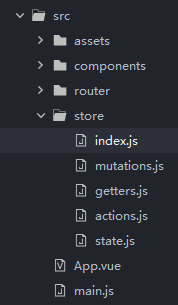

# VueX的使用

> **Vuex** 是一个专为 Vue.js 应用程序开发的状态管理模式。其思想借鉴于**Flux**， **Redux**。它采用集中式存储管理应用的所有组件的状态，并以相应的规则保证状态以一种可预测的方式发生变化。

* 介绍： [VueX是什么](https://vuex.vuejs.org/zh/)

## 为什么要使用Vuex

* 所谓的状态管理模式的状态，可以理解为一组通过 **Vuex** 进行维护的全局变量。一些用户的个人参数，亦或是多组件共同维护的prop。为了正确维护这些参数，可以使用数据库进行存储，也可以在各类组件之间多次传递。虽然方法可行，但在维护的过程中，可以明显感受非常麻烦。此时使用 **Vuex** 来进行存储与维护，很容易就能化繁为简。当然，**Vuex** 并不适合用于比较小型的应用。

## 引入Vuex

* 安装

  ```shell
  npm install --save vuex
  ```

* vue-cli项目引入vuex

  ```javascript
  import Vue from 'vue';
  import Vuex from 'vuex'; //引入Vuex
  import App from './App'
  import router from './router'

  //使用Vuex
  Vue.use(Vuex);

  //定义Vuex实例
  const store = new Vuex.Store({

  })

  new Vue({
    el: '#app',
    store, //全局挂载Vuex
    router,
    components: { App },
    template: '<App/>'
  })
  ```

## Vuex核心概念

* **state** 用于共享数据存储

* **getter** 用于对共享数据进行处理操作

* **mutation** 用于注册改变数据状态

* **action** 解决异步改变共享数据

* **module** 数据维护模块化

从项目的角度考虑，可以将这五大核心分别进行维护，由于 **module** 相对于其他特征有所区别，所以先不进行引入。




### **State**

> 数据存储的位置，对象类型直接维护数据

* 定义

  ```javascript
  const state = {
    msg: 'Hello Vuex!';
  }
  export default state;
  ```

* 使用
  
  由于store已在Vue实例上进行全局挂载，所以我们可以直接获取到state中所储存的数据，其中this指向Vue实例。可以配合computed计算属性使用，或者在加载组件时进行赋值。

  ```javascript
  this.msg = this.$store.state.msg; // "Hello Vuex!"
  ```

  如果有安装vue-devtool，可以在其中Vuex的Tab页直接看到state所储存的数据。

* mapState函数

  对于state内数据进行实时的监听和使用，很容易想到计算属性computed，比如

  ```javascript
  export default {
    computed: {
      msg1() {
        return this.$store.state.msg1;
      },
      msg2() {
        return this.$store.state.msg2;
      }
    }
  }
  ```

  这样通过计算属性获取与msg同名的state.msg属性，就显得有些冗余了，在参数较少的情况下可能没什么感觉，但在参数多的情况下就会显得非常麻烦，所以我们可以使用mapState函数简化这个过程

  ```javascript
  import { mapState } from 'vuex';
  export default {
    computed: {
      ...mapState({
        msg1: state => state.msg1,
        msg2: state => state.msg2 
      })
    }
  }
  ```


### **getter** 

> 对state中的数据做统一的处理操作，但并不改变数据本身

* 如果没有getter，我们要对state的数据进行一些譬如筛选的操作，可以直接对数据进行

  ```javascript
  export default {
    computed: {
      frontStr() {
        return this.$store.state.substring(0, 5); // "Hello"
      }
    }
  }
  ```

* 由于state中的参数本身具有全局变量的特征，所以常常不止一处会对其进行一些操作，如果这些操作方法类似或者相同，那代码就会显得有些冗余，这个时候就可以使用getter来维护这些方法

* 定义

  ```javascript
  const getters = {
    frontStr: state => state.msg.substring(0, 5);
  }
  export default getters;
  ```

* 使用

  ```javascript
  this.msg = this.$store.getters.frontStr;
  ```

  getter更类似于Vue中的计算属性computed，是state经过某种处理后的储存数据。它所返回的结果会被缓存起来，直到它所依赖的状态数据被改变后才会重新调用进行计算，也因而getter并不能改变state的数据本身。

* mapGetter函数

  与mapState一样，mapGetter也是出于对于代码简化的角度所考虑使用的。由于getter本身不对state数据做修改，其处理效果所返回的结果也与state一样会在计算属性中被使用，所以mapGetter的使用效果与mapState极为类似

  ```javascript
  import { mapGetter } from 'vuex';
  export default {
    computed: {
      ...mapGetter([
        'frontStr',
      ])
    }
  }
  ```

### **mutation**

> 通过在mutation内注册方法，可以对state内的数据进行修改

* 数据修改处理就与字面意思一样容易理解了，我们可以在mutation内定义修改方法来操作state的数据。

* 定义

  ```javascript
  const mutations = {
    // payload为有效荷载数据，用于储存mutation方法入参
    addStr: (state, payload) => {
      state.msg += payload.str1 + payload.str2
    },
  }
  export default mutations;
  ```

* 使用

  ```javascript
  export default {
    methods: {
      addStr() {
        this.$store.commit({
          type: 'addStr',
          str1: 'a',
          str2: 'b',
        })
      }
    },
  }
  ```

* mapMutations函数

  mutations中同样有简化代码的方法mapMutations，与mapGetters不同之处在于，mutations本身都是修改state数据的方法，所以mapMutations多为在methods属性内使用

  ```html
  <template>
    <div>
      <button @click="addStr({str1:'a',str2:'b'})">add</button>
    </div>
  </template>
  ```

  ```javascript
  import { mapMutations } from 'vuex';
  export default {
    methods: {
      ...mapMutations([
        'addStr',
      ])
    }
  }
  ```

* mutation有一个特别要注意的点是，只能使用同步方法，不可异步操作数据，任何异步操作都不会在mutations内生效。那么为了解决异步操作的问题，action就应运而生了。

### **action**

> 功能与mutation类似，但用于储存异步方法

* 在mutation中，我们也提到了异步方法需要action来进行处理，而同步方法已在mutation中处理，所以一般我们可以在action中编写异步逻辑，然后调用mutation中的同步方法，通过混用来达到action需要达到的效果。

* 定义

  ```javascript
  const actions = {
    addStrAsync(context, Object) {
      setTimeout(() => {
        context.commit({
          type: 'addStr',
          str1: Object.str1,
          str2: Object.str2
        })
      }, 1000)
    }
  }
  export default actions;
  ```

* 使用

  ```javascript
  this.$store.dispatch('addStrAsync', {str1: 'c', str2: 'd'})
  ```

* 总体来说就是以 action -> mutation -> state 的形式进行调用。但由于满足异步处理，所以Promise与async/await自然也是可以在这里进行使用的，dispatch方法可以返回一个Promise类型来处理异步。

* 返回Promise的action

  ```javascript
  //定义
  const actions = {
    action1(context) {
      return new Promise((resolve, reject) => {
        setTimeout(() => {
          context.commit('mutation1');
          resolve()
        }, 1000)
      })
    },
  }

  //使用
  this.$store.dispatch('action1').then(() => {
    this.$store.commit('mutation2');
  })
  ```

  当然也可以这样写

  ```javascript
  //定义
  const action = {
    // action1 ...
    action2({ dispatch, commit }) { //解构一下context
      return dispatch('action1').then(() => {
        commit('mutation1');
      })
    }
  }

  //使用
  this.$store.dispatch('action2');
  ```

* 使用async/await组合多个action

  ```javascript
  //定义
  const actions = {
    async action1({ commit }) {
      setTimeout(() => {
        commit('mutation1');
      }, 1000)
    },
    async action2({ dispatch, commit }) {
      await dispatch('action1')
      commit('mutation2')
    }
  }

  //使用
  this.$store.dispatch('action2')
  ```

* mapActions的使用方法与mapMutation类似，就不再具体写示例。

### **module**

> 可使vuex根据业务需要分割成多个子系统模块，分别来进行维护。当然子模块也可以继续套更小的模块，层层嵌套可以构成一棵由模块构成的状态树。

* 使用

  ```javascript
  const moduleA = {
    state: { ... },
    mutations: { ... },
    actions: { ... },
    getters: { ... }
  }

  const moduleB = {
    state: { ... },
    mutations: { ... },
    actions: { ... }
  }

  const store = new Vuex.Store({
    modules: {
      a: moduleA,
      b: moduleB
    }
  })

  store.state.a // -> moduleA 的状态
  store.state.b // -> moduleB 的状态
  ```

* 对于单一模块来说，getter，mutation等的state参数都指向当前模块的state，action则通过conext.state获得

  ```javascript
  const moduleA = {
    state: { count: 0 },
    mutations: {
      increment (state) {
        // 这里的 `state` 对象是模块的局部状态
        state.count++
      }
    },

    getters: {
      sumWithRootCount (state, getters, rootState) {
        //getters为当前模块所属命名空间的getters，commit、dispatch同理。命名空间将在下文详细介绍
        //rootState为根节点状态，它包含根节点的状态和所有子模块的状态，相当于返回了整个模块树
        return state.count + rootState.count
      }
    },

    actions: {
      incrementIfOddOnRootSum ({ state, commit, rootState }) {
        if ((state.count + rootState.count) % 2 === 1) {
          commit('increment')
        }
      }
    }
  }
  ```

* 命名空间

  默认情况下，模块内部的 action、mutation 和 getter 是注册在全局命名空间的——这样使得多个模块能够对同一 mutation 或 action 作出响应。
  
  也就是说，假设现有两个模块 moduleA 和 moduleB，两者有一个重名的 mutation 记为 mutation1，那么当我们使用这个 mutation 时，moduleA 和 moduleB 的对应 state 都回发生改变，这也就是所谓的在全局命名空间下，mutation被注册的含义。当然 action 同理。

  如果通过改变某个模块下命名空间的属性 namespaced 为 true 的方式使其成为带命名空间的模块。模块对应的getter、mutation、action 也会对应注册至该命名空间下。

   ★ **state需要与这些相区别，state作为入参时，不论是否启用命名空间，都为当前模块的state**

  我们来看官方给的一个例子

  ```javascript
  const store = new Vuex.Store({
    modules: {
      account: {
        namespaced: true,

        // 模块内容（module assets）
        state: { ... }, // 模块内的状态已经是嵌套的了，使用 `namespaced` 属性不会对其产生影响
        getters: {
          isAdmin () { ... } // -> getters['account/isAdmin']
        },
        actions: {
          login () { ... } // -> dispatch('account/login')
        },
        mutations: {
          login () { ... } // -> commit('account/login')
        },

        // 嵌套模块
        modules: {
          // 继承父模块的命名空间
          myPage: {
            getters: {
              profile () { ... } // -> getters['account/profile']
            }
          },

          // 进一步嵌套命名空间
          posts: {
            namespaced: true,
            getters: {
              popular () { ... } // -> getters['account/posts/popular']
            }
          }
        }
      }
    }
  })
  ```

  将模块想象成一棵模块树，根节点为全局命名空间，每个模块就是一个子节点，如果当前节点没有命名空间，那么它所属的命名空间就从当前节点的父辈节点往上找。

  启用了命名空间的 getter 和 action 会收到局部化的 getter，dispatch 和 commit。也就是说，你在使用模块内容（module assets）时，不会再因为入参的getters是注册在全局空间下，而需要在同一模块内额外添加空间名前缀。

* 局部命名空间访问全局内容（Global Asset）

  如果你希望使用全局 state 和 getter，rootState 和 rootGetters 会作为第三和第四参数传入 getter，也会通过 context 对象的属性传入 action。

  ```javascript
  //启用命名空间的getter
  getters: {
    someGetter (state, getters, rootState, rootGetters) {
      getters.someOtherGetter // -> 'foo/someOtherGetter'
      rootGetters.someOtherGetter // -> 'someOtherGetter'
    },
    someOtherGetter: state => { ... }
  },
  ```

  若需要在全局命名空间内分发 action 或提交 mutation，将 { root: true } 作为第三参数传给 dispatch 或 commit 即可。

  ```javascript
  //启用命名空间的action
  actions: {
    someAction ({ dispatch, commit, getters, rootGetters }) {
      getters.someGetter // -> 'foo/someGetter'
      rootGetters.someGetter // -> 'someGetter'

      dispatch('someOtherAction') // -> 'foo/someOtherAction'
      dispatch('someOtherAction', null, { root: true }) // -> 'someOtherAction'

      commit('someMutation') // -> 'foo/someMutation'
      commit('someMutation', null, { root: true }) // -> 'someMutation'
    },
    someOtherAction (context, payload) { ... }
  }
  ```

* 在局部命名空间注册全局action

  若需要在带命名空间的模块注册全局 action，则可添加 root: true，并将这个 action 的定义放在函数 handler 中，类似深度监听Object的写法。

  ```javascript
  actions: {
    someAction: {
      root: true,
      handler (namespacedContext, payload) { ... } // -> 'someAction'
    }
  }
  ```

* 带命名空间使用绑定方法

  带命名空间使用mapState、mapActions等方法时，难免会碰到前缀过长，或是命名空间路径比较长的情况，我们可以将部分命名空间提出为第一个参数来进行使用。

  ```javascript
  computed: {
    ...mapState('some/nested/module', {
      a: state => state.a,
      b: state => state.b
    })
  },
  methods: {
    ...mapActions('some/nested/module', [
      'foo', // -> this.foo()
      'bar' // -> this.bar()
    ])
  }
  ```

  也可以通过 createNamespacedHelpers 辅助，让绑定方法更加简单，这对实际编写系统来说，用处也是极大的。

  ```javascript
  import { createNamespacedHelpers } from 'vuex'
  const { mapState, mapActions } = createNamespacedHelpers('some/nested/module')
  export default {
    computed: {
      // 在 `some/nested/module` 中查找
      ...mapState({
        a: state => state.a,
        b: state => state.b
      })
    },
    methods: {
      // 在 `some/nested/module` 中查找
      ...mapActions([
        'foo',
        'bar'
      ])
    }
  }
  ```

### 结语

Vuex可以说是Vue中相当重要的一块内容。对于兄弟组件之间的传值，系统的一些全局状态控制都有很大的帮助。本文通过参考官方文档以及通过demo对Vuex的使用，对Vuex大部分的内容进行了介绍。简单运用的话很快就能上手，但如果想要更熟练的运用，以及把Vuex设计的与整个工程更加匹配，需要更深入的学习，以及更多的开发经验。
