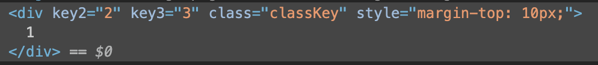
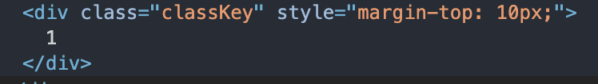
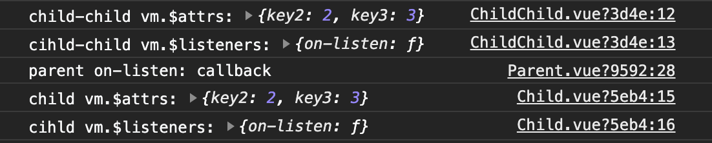

# Vue组件通信整理

## 1. v-bind 与 props

  > Vue中使用最为普遍的父子组件通信方式，传递方向，父组件 -> 子组件

  父组件通过v-bind绑定参数传递至子组件，子组件通过props同名参数进行接收

  ```html
  <!-- 父组件调用子组件 -->
  <div id="parent">
    <child-component :oneProp="oneProp"></child-component>
  </div>
  ```

  ```js
  /* 子组件接收 */
  var vm = new Vue({
    el: "#children",
    props: {
      oneProp: {
        type: String,
        default: ''
      }
    }
  })
  ```

  子组件在``created``即可接收到来自父组件的props。接收到数据后，可以与data一样，绑定至需要渲染的view层组件上，亦或是监听、修改。

  props一个非常显著的特点就是**单项绑定**。在上述样例中，父组件的``oneProp``通过v-bind绑定了一个动态参数，该值是可以改变的。当父组件的``oneProp``发生变化时，即会对子组件对应的props产生影响，并且在有watch监听的情况下，触发监听方法。而当子组件内部对值进行修改时，并不会影响父组件中绑定的参数。

  props的单项绑定其实很容易造成父子组件数据不同步的问题，而有些用于通信的props又要保证父子组件所绑定参数的双向性，而这就涉及到子组件向父组件的通信方法。

## 2. vm.$emit 与 v-on

  > Vue中又一常用通信方式，传递方向，子组件 -> 父组件

  在子组件中使用``vm.$emit``方法，将子组件中的值传递给父组件，父组件则通过``v-on``事件进行接收，与props配合使用即可达成父子组件数据的双向通信。扩充一下上面的代码：

  * 父组件部分

    ```html
    <div id="parent">
      <child-component
        :oneProp="oneProp"
        @on-receive="handleReceive"
      />
    </div>
    ```

    ```js
    var parent = new Vue({
      el: "#parent",
      data: {
        oneProp: 1
      }
      methods: {
        handleReceive(arg) {
          this.oneProp = agr;
        }
      }
    })
    ```
  
  * 子组件部分

    ```js
    var child = new Vue({
      el: "#children",
      props: {
        oneProp: Number
      },
      mounted() {
        this.oneProp = this.oneProp + 1;
        this.$emit('on-receive', this.oneProp); // 第一个入参用于对应v-on时间名称，第二个入参用于传递参数
      }
    })
    ```

  * Vue双向绑定的精髓指令v-model，本质上就是一种Vue已经内置的props，当具有v-model绑定的内容时，子组件可以通过名为``value``的props对绑定内容进行监听，同时可以通过``$emit('input')``将内部值更新后的内容返回给父组件，这里的``input``事件同样是Vue内置的专门用于``v-model``通信的事件。这两格内置的参数与方法对于具有``v-model``属性的自定义组件非常重要。同时，通常在设计时，会在子组件内部定义一个内部参数与内部监听方法，来与父组件传入的``value``进行区分。

  * 子组件部分

    ```js
    var child = new Vue({
      el: "#children",
      data: {
        innerValue: 0,
      }
      props: {
        value: Number
      },
      watch: {
        value(newVal) { // 外部监听，用于父->子通信传值
          this.innerValue = newVal;
        },
        innerValue(newVal) { // 内部监听，用于子->父通信传值
          this.$emit('input', newVal);
        }
      }
    })
    ```

  * 父组件部分

    ```html
    <!-- 父组件无需定义@input事件，自动接收并改变param内容 -->
    <div id="parent">
      <child-component v-model="param" />
    </div>
    ```
  
## 3. vm.$ref 与 vm.$parent

  ``$ref``与``$parent``严格来说并不属于组件数据通信范畴。它们可以但并不推荐使用于数据通信，``$ref``与``$parent``本质上是DOM实例创建成功后，Vue在各个组件中记录的一个组件实例属性，可以在父组件引用子组件时为子组件标记一个ref，父组件就可以从实际上获取到子组件的所有内容。

  * 父组件部分

    ```html
    <div id="parent">
      <child-component ref="child" />
    </div>
    ```
    
    ```js
    var parent = new Vue({
      el: "#parent"
      mounted() {
        console.log(this.$refs.child.innerValue); // 1 mounted时，实例创建完成
      },
      created() {
        console.log(this.$refs); // undefined  实例未创建完成
      }
    })
    ```
  
  * 子组件部分

    ```js
    var children = new Vue({
      el: "#children"
      data: {
        innerValue: 1
      }
    })
    ```
  
  可以获取到所有内容，自然也不仅限于参数，包括子组件的方法也同样可以调用。往往通过调用子组件的方法，来改变子组件内部的一些参数。这里其实可以看出Vue组件之间的参数、方法互相调用的自由度其实是很高的，尤其是外部组件调用内部组件的方法来操作内部组件的参数，其实很容易造成数据流的混乱或者不安全性。所以对于方法命名时，可以尽可能的将私有方法与公共方法进行命名或者注释上的区分，来保证安全调用与数据通信。
  
  而``$parent``则无需定义类似ref的参数，子组件内自然可以获取到父组件的实例，调用方法与``$ref``类似，这里就不过多赘述。

## 4. provide 与 inject

  > Vue 2.2新增属性，跨层级通信的方式之一，用于属于同一路径，或者说爷孙组件节点间的数据通信

  之前所介绍的三种方式，均为父子组件的通信方法，而在日常开发的场景中，必然会存在跨多级的数据传递。而从本点开始，就开始介绍跨级的数据通信方法。
 
  ``provide``与``inject``为Vue实例的属性之一，类似于一个跨层级的prop。但与prop的区别，除了跨层级以外，还有就是数据是非响应的。也就是说祖辈节点所提供(``provide``)的属性，能被孙辈所接收，但仅能取到第一次所接收的值，如果祖辈节点的数据发生变化，其子节点无法接收到响应变化后的数据。按照Vue中文文档的说法，这是刻意而为之，也许是考虑到如果涉及到的子节点过多，容易导致数据流的混乱。

  * 祖组件部分

  ```js
  var provider = new Vue({
    el: "#parent"
    provide: {
      foo: 1
    }
  })
  ```

  * 孙组件部分

  ```js
  var Child = new Vue({
    inject: ['foo'],
    created () {
      console.log(this.foo) // => 1
    }
  })
  ```

  当然，在复杂多变的开发场景下，我们对于数据需要响应变化的情况必然会存在。如果将``provide``部分的数据优化为响应式数据，即可补足响应的功能。在Vue 2.6后，Vue就提供了``observable``方法来将数据转化为响应式数据。这一方法可以用于``provide``中的数据，同样也可以用于VueX中的state的响应。

  * 优化后的祖组件

  ```js
  import Vue from 'vue'
  var provider = new Vue({
    el: "#parent"
    provide: {
      foo: Vue.obervable(1)
    }
  })
  ```
  
## 5. VueX 与 LocalStorage

  > 跨层级跨节点通信方式，适用于共用组件较多的数据的通信。

  VueX是Vue的状态管理器，类比与React与Redux，VueX的详细介绍可参考本文档的[VueX的使用](https://xiaobaihaha0001.gitbook.io/tech-share/vue/vuex-de-shi-yong)。
  
  而Storage则完全借助浏览器缓存的功能来达到存储传递全局或是作用域较广的变量的效果。理解与使用起来都比较容易。

  ```js
  // 存储
  window.localStorage.setItem('prop', param);

  // 使用
  window.localStorage.getItem('prop');
  ```

## 6. vm.$attrs 与 vm.$listeners

  > Vue 2.4 中新增的API，用于跨层级跨节点间的数据通信，适用于共用组件比较少的数据，对比于VueX。

  ### vm.$attrs

  ``Vue.js``中文文档对于这``$attrs``的说明如下

  * ``vm.$attrs``: 包含了父作用域中不作为 ``prop`` 被识别 (且获取) 的 ``attribute`` 绑定 (``class`` 和 ``style`` 除外)。当一个组件没有声明任何 ``prop`` 时，这里会包含所有父作用域的绑定 (``class`` 和 ``style`` 除外)，并且可以通过 ``v-bind="$attrs"`` 传入内部组件。

  可以看出中文文档的描述还是比较抽象和书面化的，那么用代码的形式来理解一下，我们先简单构建一组父子组件。

  * 父组件部分

    ```html
    <template>
      <child
        :key1="key1"
        :key2="key2"
        :key3="key3"
        :style="styleKey"
        :class="classKey" 
      >
    </template>
    ```

    ```js
    var parent = new Vue({
      el: '#parent',
      data() {
        return {
          key1: 1
          key2: 2
          key3: 3
          style: 'margin-top: 10px'
          class: 'classKey'
        }
      }
    })
    ```

  * 子组件部分

    ```js
    var child = new Vue({
      el: '#child',
      props: {
        key1: String,
      }
      mounted() {
        console.log('child vm.$attrs:', this.$attrs); // "child vm.$attrs: { key2: 2, key3: 3 }"
      }
    })
    ```

  父作用域中的``attribute``其实就是子组件中由父组件传入而又不在``props``中记录的数据。这部分的数据在``Vue``中其实在``2.4.0``以前就会将其记录在dom当中，我们可以看一下dom结构。

  

  而在引入了``$attrs``之后，就将相当于在Vue实例中提供了一个属性用于存储这一部分的数据。在子组件的``mounted``部分输出``this.$attrs``，可以看到``key2``与``key3``两对键值.与此同时，也可以注意到``class``与``style``两个字段也没有被记录到``$attrs``当中。至此，通过代码，我们就可以充分理解``$attrs``的含义了。联想到其本质用途———用于小范围内跨组件传递参数。单在父子组件间传递的参数，会通过props记录，而跨组件部分的参数，就会以``$attrs``属性，通过子组件传递至子组件的子组件(下称孙组件)。那么扩写一下子组件与孙组件。

  * 子组件部分

    ```html
    <template>
      <child-child v-bind="$attrs" />
    </template>
    ```

  * 孙组件部分

    ```js
    var childchild = new Vue({
      el: '#childchild',
      inheritAttrs: false,
      mounted() {
        console.log('child-child vm.$attrs:', this.$attrs); // "child-child vm.$attrs: { key2: 2, key3: 3 }"
      }
    })
    ```

  这样就成功的将父组件中的属性通过子组件``$attrs``转发，传递至孙组件。

  补充：如果不想要在dom中暴露跨组件传递的参数，``Vue``也提供了对应的属性配合``$attrs``使用，在子组件中设置``inheritAttrs: false``即可。

  


  ### $vm.$listeners

  ``$attrs``之后再看``$listeners``就比较好理解了。依旧先看中文文档的说明。

  ``vm.$listeners``: 包含了父作用域中的 (不含 ``.native`` 修饰器的) ``v-on`` 事件监听器。它可以通过 ``v-on="$listeners"`` 传入内部组件——在创建更高层次的组件时非常有用。

  对比于``props``和``$emit``，``$listeners``就是通过跨组件传递绑定事件，来实现孙组件至父组件的参数回传。那么再次扩写父、子、孙三代组件。

  * 父组件部分

    ```html
    <template>
      <child @on-listen="handleListen"/>
    </template>
    ```
  
    ```js
    var parent = new Vue({
      el: '#parent',
      components: { Child }
      methods: {
        handleListen(arg) {
          console.log('parent on-listen:', arg);
        }
      }
    })
    ```
  
  * 子组件部分

    ```html
    <template>
      <child-child v-bind="$attrs" v-on="$listeners" />
    </template>
    ```

    ```js
    var child = new Vue({
      el: '#child',
      inheritAttrs: false,
      components: { ChildChild },
      mounted() {
        console.log('child vm.$attrs:', this.$attrs);
        console.log('cihld vm.$listeners:', this.$listeners);
      },
    })
    ```

    * 孙组件部分

    ```js
    var childchild = new Vue({
      el: '#childchild',
      inheritAttrs: false,
      mounted() {
        console.log('child-child vm.$attrs:', this.$attrs);
        console.log('cihld-child vm.$listeners:', this.$listeners);
        this.$emit('on-listen', 'callback'); // 对应于父组件中的on-listen事件
      }
    })
    ```

  * 查看输出结果，我们可以看到孙组件中通过``on-listen``事件返回的参数，成功在父组件中进行了输出。

    


## 7. EventBus(总线模式)

Vue的总线模式，是一个自由度比较高的数据传递模式，可以说是VueX的前身。简单描述下就好比一个传送带，上面有着各类不同组件上传的数据。而其他组件也可以从传送带上获取到数据。

那么直接来看如何使用总线模式。总线模式创建，需要在Vue实例中引入一个新的Vue实例。而该实例可以视作一个不具有组件功能的实例。

* 单文件引入总线模式

  ```js
  // event-bus.js
  import Vue from 'vue'
  const eventBus = new Vue()
  ```

* 入口文件引入总线模式

  ```js
  // main.js event-bus
  import Vue from 'vue'
  Vue.prototype.$EventBus = new Vue()
  ```

创建完实例，意味着当前组件实例已经加入到总线模式当中。总线模式下没有必要将组件看成一个树状解构，所有组件都处于一个平等的状态，通过总线模式对应的事件，就能够实现数据的传递。

* 发送组件

  ```js
  // a-comp
  import { eventBus } from 'event-bus.js'
  var send = new Vue({
    el: 'a-comp',
    mounted() {
      this.$emit('send-from-a', 'This msg sent from a-component');
    }
  })
  ```

* 接收组件

  ```js
  import { eventBus } from 'event-bus.js'
  var receive = new Vue({
    el: 'b-comp',
    mounted() {
      this.$on('send-from-a', (msg) => {
        console.log(msg); // 'This msg sent from a-component'
      })
    }
  })
  ```

通过代码，很容易看出总线模式是一种十分方便的组件通信方法，不过由于自由度过高，过度使用亦或是使用不慎的情况下，很容易造成数据流的混乱，所以已经逐渐被VueX这类易于管理的状态管理模式所取代。

另外，Vue作为单页面应用所广泛使用的前端框架，当界面进行刷新的时候，总线模式就会被更新，进而无法完成一些业务操作。故在进行使用时，需要处理好总线销毁事件。

  ```js
  import { eventBus } from './event-bus.js'
  EventBus.$off('send-from-a')
  ```

## 总结

本文一共对七种Vue中可作为组件数据通信的方法进行了整理。简单的数据传递有如``v-bind``与``vm.$emit()``方法，也有跨组件传输所使用的``$attrs``与``$listeners``。对于单页面多组件应用来说，在组件间保持一个健康可控的数据流非常重要。需要能够在不同场景下正确的使用这些传递方法。

