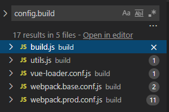

# vue-cli2.x 的使用与项目结构分析

> vue-cli是vue官方提供的一个前端脚手架，专门用于快速构建一个单页面web应用，自动生成基于vue + webpack的项目模板。

## 基本使用

### 引入vue-cli

* 全局引入vue-cli2.x

  ```shell
  npm install -g vue-cli
  ```

* 引入完成检测

  ```shell
  vue --version
  ```

* 注：区别于vue-cli3.x的引入方法

  ```shell
  npm install -g @vue/cli
  ```

### 创建项目

* 在所需目录下，创建一个基于vue + webpack的前端项目

  ```shell
  vue init webpack <project-name>
  ```

* 根据提示配置信息后创建完成

  

## 代码结构

### 代码目录

```
vue-cli-demo
├─ build         // 打包与webpack配置
├─ config        // 开发环境与生产环境配置
├─ node_modules  // 依赖包
├─ src           // 代码文件
├─ static        // 静态文件
├─ .babelrc      // babel编译器配置
├─ .editconfig   // 项目统一代码风格配置
├─ .gitignore
├─ .postcssrc.js // 浏览器兼容配置
├─ index.html    // 入口文档
├─ package-lock.json
├─ package.json
└─ README.md     // 项目说明
```

### 代码文件构成

```
src
├─assets     // 图片资源
├─components // Vue页面/组件
├─router     // vue-router配置
├─App.vue
└─main.js
```

```javascript
// main.js
import Vue from 'vue'
import App from './App' // 引入入口组件App
import router from './router' // 引入vue-router配置

Vue.config.productionTip = false // 关闭开发环境下的官方提示

new Vue({
  el: '#app',
  router,
  components: { App },
  template: '<App/>'
})
```

首先来看main.js的内容，这也是整个项目代码部分的入口。其功能，就是创建了一个Vue实例，并且引入了名为App的入口组件。这也是整个项目唯一一次创建Vue实例。在这点上可以有些理解：

* 作为一个单页面应用的脚手架，项目构建的页面就只有一个Vue实例。若在浏览器或者客户端下打开新的页面，则两个页面属于两个不同的实例。

* Vue文件本身就是一个实例，但同时也可以被注册成为Vue组件(component)被其他组件所引入，而作为组件引入时，不将其视为一个实例看待。

* vue-cli的Vue实例挂载在id为app的dom上，这一点我们也可以在入口文档index.html中看到。

  ```html
  <!-- index.html -->
  <!DOCTYPE html>
  <html>
    <!-- ... -->
    <body>
      <div id="app"></div>
    </body>
  </html>
  ```

* 实例引入的App组件，相当于一个根节点，通过router将不同界面串在一起，构成一棵树。不同界面下也可以引入新的组件，组件之间可以进行通信等操作。

那么再来看一下main.js中反复提及的App组件与router:

```html
<!-- App.vue -->
<template>
  <div id="app">
    
    <router-view/>
  </div>
</template>
```

App.vue其实就是一个正常的Vue文件，上述代码给出了代码模板的部分，vue-cli作为官方脚手架很自然的引入了一个Vue的logo，当然这肯定得直接去掉。然后就是router标签，可以在上文main.js里看到，在Vue实例创建的时候就全局挂载了router，所以App.vue不再需要引入什么文件就可以直接使用router，这与Vuex同理。

```javascript
// router/index.js
import Vue from 'vue'
import Router from 'vue-router'
import HelloWorld from '@/components/HelloWorld'

Vue.use(Router)

export default new Router({
  routes: [
    {
      path: '/',
      name: 'HelloWorld',
      component: HelloWorld
    }
  ]
})
```

router部分则就是vue-router的引入、使用，以及注册在router上的Vue组件的配置，vue-cli默认会注册一个HelloWorld组件，我们可以在components下面找到，这个HelloWorld也算是官方给出的一个Vue文件的标准写法。

### 基础配置

Vue入口与基本的代码结构清楚之后，再来看config目录下的基础配置，文件目录如下：

```
config
├─dev.env.js  // 开发环境配置
├─index.js    // 基础配置
└─prod.env.js // 生产环境配置
```

开发环境与生产环境的配置其实就是在两个环境下设置不同node的全局变量来区分两个环境

```javascript
// prod.env.js
'use strict'
module.exports = {
  NODE_ENV: '"production"'
}
```

```javascript
// dev.env.js
'use strict'
const merge = require('webpack-merge')
const prodEnv = require('./prod.env')

module.exports = merge(prodEnv, {
  NODE_ENV: '"development"'
})
```

那么看了代码后很容易就有一个疑问，为什么开发环境要多此一举地用 webapck-merge，直接和生产环境一样的写法不是更好？

* 其实光看默认给的代码，确实是多此一举，但真正在开发的时候，两个环境下必然存在其他的配置，使用 webpack-merge 后，在生产环境添加的配置，就不用在开发环境再添加一遍，节省了时间，提高了容错率。而开发环境特有的配置只需在开发环境的配置中添加即可。

* 当然有个问题是这个写法没法为生产环境提供特有的配置，但是在实际生产中，其实生产环境需要的配置往往在开发环境下也是必要的，这也是为什么要把merge加在开发环境下的原因。

接下来是基础配置下的 config/index.js 文件，所谓的基础配置，其实也是webpack中的部分配置和打包脚本的部分配置。config/index.js 文件中的内容，更倾向于面向开发人员的个性配置。那么直接来看代码。

```javascript
// config/index.js
const path = require('path')

module.exports = {
  dev: {
    // ...
  },
  build: {
    // ...
  }
}
```

整体来看，就配置了 dev 与 build ，也就是上文说的 webpack 开发环境部分和打包脚本部分的面向开发的配置。其实从引入角度也可以看出来。


dev 的配置重点在 webapck.dev.conf.js 内进行了使用，下文也会提及。而在其他文件中的使用，就都是配合条件运算符(?:)区分环境来使用的。再看dev 部分的代码。

```javascript
module.exports = {
  dev: {
    // Paths
    assetsSubDirectory: 'static', // 静态资源存放路径
    assetsPublicPath: '/', // 根目录下存放静态资源
    proxyTable: {}, // 跨域配置

    // Various Dev Server settings
    host: 'localhost', // 本地运行地址，可用process.env.HOST代替
    port: 8080, // 本地运行端口，可用process.env.PORT代替
    autoOpenBrowser: false, // 是否运行代码后自动打开浏览器
    errorOverlay: true, // 是否在控制台显示报错
    notifyOnErrors: true, // 是否使用FriendlyErrorsPlugin调整报错内容
    poll: false, // 是否开启代码变化的监听，也可以配置具体数据来作为时间轮询监听
    
    // Source Maps
    devtool: 'cheap-module-eval-source-map', // 控制台中显示的代码内容，不同的source-map会显示不同的代码（如打包前，打包后的代码），且构建速度各有区别。开发环境下使用的这个source-map有助于调试。
    cacheBusting: true, // 个人理解是在代码改变后用于改变控制台代码的缓存，方便开发调试
    cssSourceMap: true // 是否开启css代码转换，设为false后将无法在控制台定位样式代码的来源，所以开发环境下最好为true
  },
  build: {
    // ...
  }
}
```



build 则重点在 webpack.prod.conf.js 内进行了使用，而其他地方的使用其实都是在条件应算符下与dev相对应的选择。所以打包的配置同时也可以说是生产环境的配置。

```javascript
module.exports = {
  dev: {
    // ...
  },
  build: {
    // Template for index.html
    index: path.resolve(__dirname, '../dist/index.html'), // 打包后index.html的位置

    // Paths
    assetsRoot: path.resolve(__dirname, '../dist'), // 打包后的静态资源位置
    assetsSubDirectory: 'static', // 打包后静态资源文件夹 
    assetsPublicPath: '/', // 静态资源相对index.html的位置，'/'表示绝对路径。打包后在本地打开index.html会出现页面静态资源加载不出的情况，改为'./'可解决，而运行至服务器的代码需要保持'/'的设置，当然有特殊情况其他再论。

    // Source Maps
    productionSourceMap: true, // 控制打包后的js、css文件是否生成map文件
    devtool: '#source-map', // 代码转换配置，控制台将显示打包后的代码

    productionGzip: false, // 是否开启gzip，需要配合后端使用，若开启，需要先安装依赖compression-webpack-plugin
    productionGzipExtensions: ['js', 'css'], // gzip支持的文件类型

    bundleAnalyzerReport: process.env.npm_config_report // 能够在浏览器中看到bundle的分析图
}
```

### webapck配置

webpack配置位于build文件夹下，具体目录如下

```
build
├─build.js
├─check-version.js
├─logo.png
├─utils.js // 工具类方法
├─vue-loader.conf.js   // webpack中vue-loader配置模块
├─webpack.base.conf.js // webpack基础配置
├─webpack.dev.conf.js  // 开发环境webpack配置
└─webpack.prod.conf.js // 生产环境webpack配置
```

#### webpack.base.conf.js

那么从 webpack 基础配置开始入手，开发环境和生产环境的 webpack 配置无非就是根据环境区分后，一同 merge 至基础配置上的。

```javascript
// webpack.base.conf.js
'use strict'
const path = require('path')
const utils = require('./utils')
const config = require('../config')
const vueLoaderConfig = require('./vue-loader.conf')

function resolve (dir) {
  return path.join(__dirname, '..', dir)
}
```

先看开头部分，引入了 node 模块 path，同目录下的 util.js (工具类方法) 与 vue-loader.conf.js (vue-loader配置模块)，以及上文基础配置中提到的 config/index.js。

另外封装了 path.join() 的方法，这边简单提一下path内部的方法与参数：

* path.resolve([from...],to) - 把一个路径或路径片段的序列解析为一个绝对路径。相当于执行cd操作。

* path.join(path1，path2，path3.......) - 将路径片段使用特定的分隔符( window：\ )连接起来形成路径，并规范化生成的路径。若任意一个路径片段类型错误，会报错。若某个片段为 '..'，则会回到目录的上一级。

* __dirname - 当前被执行文件所在的目录。

接下来看正文部分。

```javascript
module.exports = {
  context: path.resolve(__dirname, '../'), // webpack上下文，解析入口的起点，将入口路径设置为build文件夹上一级的项目根目录。由于webpack配置没有放置于根目录下，所以需要增加这个配置，保证后续相对路径的准确。
  entry: { // webpack入口，上文“代码文件构成”部分已经提及，整个vue实例的入口
    app: './src/main.js'
  },
  output: {
    path: config.build.assetsRoot, // 出口文件路径
    filename: '[name].js', // 打包生成的bundle文件名称
    publicPath: process.env.NODE_ENV === 'production' // 外部静态资源路径，根据环境配置加以区别
      ? config.build.assetsPublicPath
      : config.dev.assetsPublicPath
  },
  resolve: {
    extensions: ['.js', '.vue', '.json'], // 引入js、vue、json文件时不需要扩展名
    alias: { // import或require时的翻译解析
      'vue$': 'vue/dist/vue.esm.js', // import 'vue' 时，指代引入该路径下的js文件
      '@': resolve('src'), // resolve 方法将 'src' 解析为 '根目录/src' ，当前配置下使用 '@' 来方便代码内部互相引用，如引入组件可直接写为 import component from '@components/component'，来指代引入src/components下的组件。
    }
  },
  module: { // 根据扩展名解析文件
    // ...  
  },
  node: {
    // prevent webpack from injecting useless setImmediate polyfill because Vue
    // source contains it (although only uses it if it's native).
    setImmediate: false,
    // prevent webpack from injecting mocks to Node native modules
    // that does not make sense for the client
    dgram: 'empty',
    fs: 'empty',
    net: 'empty',
    tls: 'empty',
    child_process: 'empty'
  }
}
```

在看webpack的module配置之前，先来看一看工具类内的方法 assetsPath 和 vue-loader 的配置内容，配合上文基础配置的内容，我们很容易就能知道assetsPath的作用就是将静态资源放入static文件夹下。

```javascript
// util.js
exports.assetsPath = function (_path) {
  const assetsSubDirectory = process.env.NODE_ENV === 'production'
    ? config.build.assetsSubDirectory
    : config.dev.assetsSubDirectory

  return path.posix.join(assetsSubDirectory, _path)
}
```

```javascript
// vue-loader.conf.js
// ...
module.exports = {
  // scourceMap方面的配置
  loaders: utils.cssLoaders({
    sourceMap: sourceMapEnabled,
    extract: isProduction
  }),
  cssSourceMap: sourceMapEnabled,
  cacheBusting: config.dev.cacheBusting,
  
  transformToRequire: {
    video: ['src', 'poster'],
    source: 'src',
    img: 'src',
    image: 'xlink:href'
  }
}
```

在vue-loader中，有个 transformToRequire 的配置，它节省了组件在引入一些资源时，需要的引入代码，举个例子。

```html
<avatar :src="logoUrl"></avatar>
```

现在有个 <avatar> 控件，我们用原生的 src 来引入其需要的图片，logoUrl 表示路径参数，在没有 transformToRequire 的配置时，我们需要用 require 或者 import 来引入资源。

```javascript
export default {
  data() {
    return{
      logoUrl: require('./asset/logo.png')
    }
  }
}
```

而当在vue-loader中配置了 transformToRequire 的内容后，引入这些资源就可以按如下的写法来写。于是代码就简化了。

```html
<avatar src="./asset/logo.png"></avatar>
```

那么，继续看module部分的配置，就显得非常简单了，使用 vue-loader 解析 vue 文件。其他就是常规配置，包括 babel-loader 解析 js 文件等。图片、视频、字体等资源也用了相应的 loader 进行解析，并打包至static文件夹下。

```javascript
module.exports = {
  // ...
  module: {
    rules: [
      { // 使用vue-loader解析vue文件，具体配置写于vue-loader.conf.js中
        test: /\.vue$/,
        loader: 'vue-loader',
        options: vueLoaderConfig
      },
      { // 解析js代码，具体路径为src，test，以及依赖中的js代码
        test: /\.js$/,
        loader: 'babel-loader',
        include: [resolve('src'), resolve('test'), resolve('node_modules/webpack-dev-server/client')]
      },
      {
        test: /\.(png|jpe?g|gif|svg)(\?.*)?$/,
        loader: 'url-loader',
        options: {
          limit: 10000,
          name: utils.assetsPath('img/[name].[hash:7].[ext]')
        }
      },
      {
        test: /\.(mp4|webm|ogg|mp3|wav|flac|aac)(\?.*)?$/,
        loader: 'url-loader',
        options: {
          limit: 10000,
          name: utils.assetsPath('media/[name].[hash:7].[ext]')
        }
      },
      {
        test: /\.(woff2?|eot|ttf|otf)(\?.*)?$/,
        loader: 'url-loader',
        options: {
          limit: 10000,
          name: utils.assetsPath('fonts/[name].[hash:7].[ext]')
        }
      }
    ]
  }
}
```

#### webpack.dev.conf.js

继续看开发环境下 webpack 的配置，首先分析一波引入的模块。

```javascript
'use strict'
const utils = require('./utils')
const webpack = require('webpack')
const config = require('../config')
const merge = require('webpack-merge')
const path = require('path')
const baseWebpackConfig = require('./webpack.base.conf')
const CopyWebpackPlugin = require('copy-webpack-plugin')
const HtmlWebpackPlugin = require('html-webpack-plugin')
const FriendlyErrorsPlugin = require('friendly-errors-webpack-plugin')
const portfinder = require('portfinder')
```

都还是一些比较正常的本地配置与外部插件引入。值得提一提的就是几个插件，

* CopyWebpackPlugin : webpack拷贝静态资源插件；

* HtmlWebpackPlugin : 自动生成入口html文件插件，webpack的老熟人插件了；

* FriendlyErrorsPlugin : 上文有提到过，用于调整报错内容;

* portfinder : npm配置端口的依赖。

接下来是主体部分的配置，

```javascript
const HOST = process.env.HOST
const PORT = process.env.PORT && Number(process.env.PORT)

const devWebpackConfig = merge(baseWebpackConfig, {
  module: {
    rules: utils.styleLoaders({ sourceMap: config.dev.cssSourceMap, usePostCSS: true })
  },
  // cheap-module-eval-source-map is faster for development
  devtool: config.dev.devtool,

  // these devServer options should be customized in /config/index.js
  devServer: {
    // ...
  },
  plugins: [
    // ...
  ]
})
```

HOST 与 POST 先留着，放到下文 devServer 里面说明。总体来看，开发环境的配置就是将开发环境特有的 webpack 配置通过 webpack-merge 合并到 webpack 基础配置当中。里面用到的开发环境特有的静态资源，比如插件 (plugin)，直接在文件内进行了引入。而其需要的自定义设置，其实看注释也可以发现，都是在上文提到的基础配置 (/config/index.js) 中，支持开发人员进行自定义配置的。

那么既然 module 和 devtool 两个部分内容比较少，就先提一提，module.rules 就在 base 配置的基础上，增加了开发环境下不同扩展名样式代码的映射方式，去看工具类(utils)的代码，可以发现样式代码支持的扩展名有 css, postcss, less, sass, scss, stylus, styl 共七种。而 devtool 则是 vue 项目主体源码在控制台的映射方式。

继续看各个部分的细节。

```javascript
const devWebpackConfig = merge(baseWebpackConfig, {
  // ...

  // these devServer options should be customized in /config/index.js
  devServer: {
    clientLogLevel: 'warning', // 控制台日志等级，默认为info，为none时不展示任何日志
    historyApiFallback: { // 任意路径出现404响应的时候会自动转跳至入口html文件
      rewrites: [
        { from: /.*/, to: path.posix.join(config.dev.assetsPublicPath, 'index.html') },
      ],
    },
    hot: true, // 模块热替换
    contentBase: false, // 配合CopyWebpackPlugin插件使用，非禁用时提供静态资源文件路径
    compress: true, // 一起服务都启用gzip压缩
    host: HOST || config.dev.host, // 关于HOST与PORT，其实可以直接在config/index.js内进行配置
    port: PORT || config.dev.port, // 配合上文埋的一个坑，我们知道HOST与PORT也可以通过node环境配置，且优先于config的配置
    open: config.dev.autoOpenBrowser, // 是否自动打开浏览器
    overlay: config.dev.errorOverlay // 在出现编译报错时，是否将报错信息整屏覆盖界面
      ? { warnings: false, errors: true } // 这边还有个人性化的配置，就是只有编译报错才覆盖，不包括warning
      : false,
    publicPath: config.dev.assetsPublicPath, // 静态资源文件目录
    proxy: config.dev.proxyTable,  // 跨域配置
    quiet: true, // 启用后，除启动信息外，其余webpack报错不会出现在控制台
    watchOptions: { // 是否开启代码变化的监听，也可以配置具体数据来作为时间轮询监听
      poll: config.dev.poll,
    }
  },
  plugins: [
    // 将开发环境特有配置信息定义为一个webpack插件
    new webpack.DefinePlugin({
      'process.env': require('../config/dev.env')
    }),
    // 基于webpack-dev-server，开发环境下用于只替换修改部分的代码模块，而不用重新编译。生产环境下HMR不可启用。
    new webpack.HotModuleReplacementPlugin(), 
    // 当开启 HMR 的时候使用该插件会显示模块的相对路径，建议用于开发环境。
    new webpack.NamedModulesPlugin(), // HMR shows correct file names in console on update.
    // 在编译出现错误时，使用 NoEmitOnErrorsPlugin 来跳过输出阶段。这样可以确保输出部分的代码(如console.log)中不会包含错误。
    new webpack.NoEmitOnErrorsPlugin(),
    // 生成项目入口html文件
    new HtmlWebpackPlugin({
      filename: 'index.html',
      template: 'index.html',
      inject: true
    }),
    // 迁移静态资源内容
    new CopyWebpackPlugin([
      {
        from: path.resolve(__dirname, '../static'),
        to: config.dev.assetsSubDirectory,
        ignore: ['.*']
      }
    ])
  ]
})
```

看完整个细节配置，其实很多内容都在 config/index.js 有所提及，这也侧面反应了 config 才是面向开发者的配置内容。

最后部分则是一个异步方法，获取到端口后开始运行webpack

```javascript
module.exports = new Promise((resolve, reject) => {
  // 在运行 webpack 前先获取到端口信息，可以是node提供，也可以直接在config内配置
  portfinder.basePort = process.env.PORT || config.dev.port
  portfinder.getPort((err, port) => {
    if (err) { // 获取失败，抛出错误
      reject(err)
    } else { // 获取成功，添加入webapck配置
      process.env.PORT = port
      devWebpackConfig.devServer.port = port

      // Add FriendlyErrorsPlugin
      devWebpackConfig.plugins.push(new FriendlyErrorsPlugin({
        compilationSuccessInfo: { // webpack运行完成提示
          messages: [`Your application is running here: http://${devWebpackConfig.devServer.host}:${port}`],
        },
        onErrors: config.dev.notifyOnErrors
        ? utils.createNotifierCallback()
        : undefined
      }))

      resolve(devWebpackConfig)
    }
  })
})
```


### 项目打包配置

### 环境配置

### 其他配置