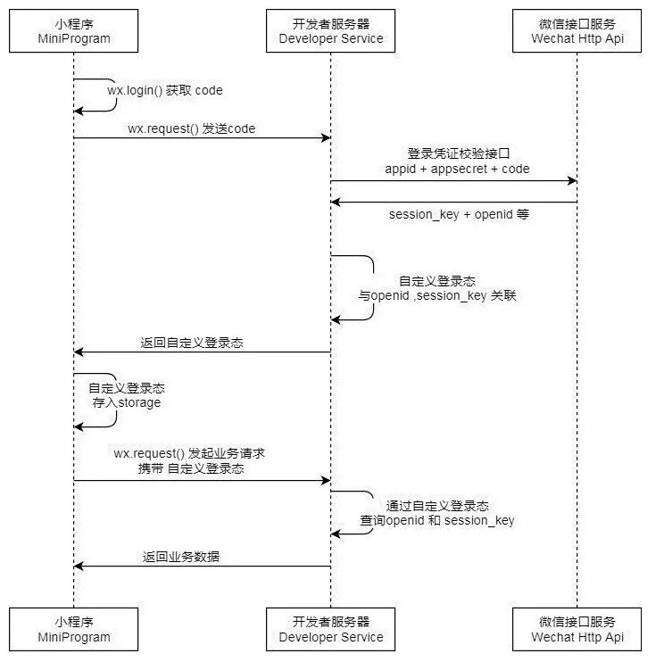

# 登录鉴权

## WEB 登录

在谈 WEB 登录之前，我们先要了解 WEB 登录的一些基础

1. HTTP 是无状态请求。我们需要在请求里加入能验证用户身份的信息，每次请求服务器对这些信息进行鉴权。一个最傻的方式就是前端请求每次都带上用户名和密码，服务器对用户名密码进行校验。
2. [Cookie](https://segmentfault.com/a/1190000004556040)浏览器的 Cookie 可以存储少量的信息，HTTP 请求的 HEADER 有一个 Cookie 字段，用于在请求时向服务器传递额外的信息

### WEB 登录流程

1. 前端通过登录接口访问后端服务，服务校验后，在服务端维护已登录用户的信息，并返回用户的一个关于这个用户登录信息的数据
2. 前端登录后，如果再次发送请求时，就会将之前后端返回的数据同样发送给后端。后端可以根据这个数据解码出用户的相关信息和登陆态

### 实现流程

前端使用 Cookie 来进行存储这个数据。在初次设置 Cookie 时，后端登录请求返回的响应 HEADER 中有一个`set-cookie`字段，这个字段用于设置前端的 Cookie。每次发送请求时，浏览器会自动将当前域下的 Cookie 加入到请求 HEADER 中。

对于后端来说，不可能将用户名和密码明文返回在`set-cookie`字段。在后端校验登录成功后，后端维护一个数据结构，使用一个 id 对应一个用户的信息（用户名，用户 Id 等），并将这个 id 返回在`set-cookie`字段。这样，当前端登录成功后再次发送请求时，后端从请求的 HEADER 里的 Cookie 字段可以找到这个 id，并回到数据结构中找到相应的用户信息，避免了在前端中明文存储用户的敏感信息。并且，伪造一个这样的 id 是比较困难的，对于登录来说也更加安全。这样的一个数据结构就是 session。

除了 session 以外，也可以不在后端单独存储一份用户信息，而是直接把这些用户信息加密成一个 token（新的字符串），直接把这个 token 返回。后续收到请求时，需要将这个 token 重新解密，得到用户的信息。整个加密解密的过程依赖后端单独存储的一个签名（密钥），这个密钥只有后端知道，也就避免了伪造 token。这种 token 方式业界常用的方法是 jwt（json web token），在后续发起请求时，官方推荐将 token 信息放在 HTTP header 中的 Authorization 字段中，例如：

```text
Authorization: Bearer <token>
```

### 两种方式存在的问题

1. session
2. 需要额外的存储空间，用户基数越大需要的存储越多
3. 如果涉及到分布式存储，多机之间的信息需要同步，不利于服务横向扩展
4. sessionId 存放在 cookie 中易导致[CSRF](https://www.ibm.com/developerworks/cn/web/1102_niugang_csrf/index.html)攻击
5. 存在跨域问题，多个域名下无法共享
6. token
7. token 一旦计算好发送出去，后端无法强制将其作废
8. 可以实现单点登录，但是无法控制单点登录，比如一个账户在 A 设备登录后也能在 B 设备登录，两者不冲突

## 小程序登录

小程序的登录接口以及获取用户信息的接口都使用微信官方的接口，开发者后端需要维护的是一个 session 结构，sessionId 是自定义，对应的数据是通过微信 HTTP API 请求后得到的用户信息。



