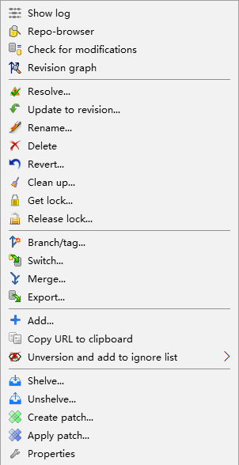
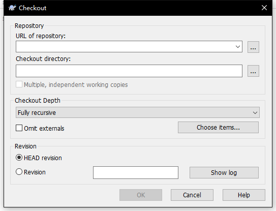

# SVN\(Subversion\)

## SVN 概述

SVN分为工作区与版本库，版本库中的所有版本由远程服务器统一管理。

不具有Git的本地commit功能，只有在网络通讯正常的情况下才能将工作区的内容提交至版本库。

## SVN工具

* tortoiseSVN
* IDE SVN插件

## SVN常用操作

SVN所有操作都可以使用tortoiseSVN图形化界面工具完成。在安装完成后，可以在指定文件夹下右击，使用到所有的SVN功能。

### SVN checkout

* 将远程服务器代码clone至本地，相当于git clone操作。
* 本地的一个文件夹在没有链接至远程仓库时，在文件夹内右击即可使用checkout功能。在一个链接至远程仓库的文件夹下创建一个新文件夹，在使用add操作后提交即可链接至仓库。新文件夹也可以链接至一个新的远程仓库，因而一个项目内不同层级可以链接至不同的仓库。
* checkout面板中可查看远程服务器中项目的文件构成，在有权限的情况下，可以针对任意文件夹任意文件进行clone至本地的操作。

### update & commit

* 最基本的更新与提交代码操作，update类似于Git的pull，commit类似于Git的commit + push。对一个链接至远程仓库的文件右击，可以直接进行update与commit操作。
* update将远程仓库的最新version更新至本地，commit将本地代码提交至远程仓库，两种操作都将使本地版本与远程仓库同步。update也可以指定历史版本进行更新。
* 远程服务器可以根据提交人、文件、提交说明对工作台进行限制，防止冲突提交，亦或是越权限提交。

### revert & add

* 将指定文件回退至当前本地版本号最原始的样子。
* 项目中新建的文件会被标记为unversioned，add后会标记为add状态，并在commit后，链接至远程仓库，已链接至远程仓库的文件不需要add操作。

## SVN实用操作

### show log

* 可以针对任意文件进行查询，可以查看到该文件所有的提交记录，在每一项记录中可以查看该版本与之前版本有差别的内容、提交人、提交说明等。

### diff

* 用于区别当前本地工作区与远程仓库的区别，防止内容覆盖，提交前查看可以防止内容覆盖。

### blame

* 查看最新版本中，文件内容精确到行的改动信息，展示文件每一行的提交人、时间、说明等。就如同blame本意，可以用于追查最新版本下，某一块文件内容的责任人。

## 推荐的SVN使用习惯

1. commit时要时刻注意unversioned的文件，也就是没有进行add操作的文件，防止遗漏。
2. commit前先进行update操作，防止因为冲突\(conflict\)而被远程仓库拒绝，在本地进行手动merge与resolve conflict，在update后本地代码依旧能正确运行后再进行提交，防止仓库代码运行出错。
3. 对于容易产生覆盖的文件进行diff操作，防止覆盖其他人的改动记录。

## 附录

* [SVN与Git的区别](https://www.cnblogs.com/Sungeek/p/9152223.html)

