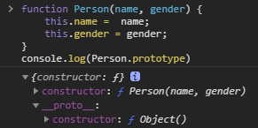
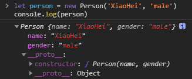
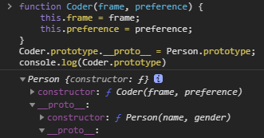
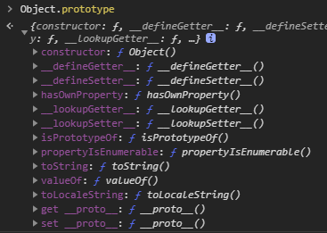

# JavaScript 原型\(2\) - 原型与原型链

> 在上周对 [js 构造函数](https://github.com/fff455/fe-share/blob/master/JavaScript/js%E6%9E%84%E9%80%A0%E5%87%BD%E6%95%B0.md) 进行了解后，本周开始理解 js 原型与原型链的部分。

## 1. 原型与原型对象的含义

在构造函数中，存在一个特殊的对象类型的属性原型对象 \(**prototype**\)，其实并非只有构造函数，每个函数都具有这个属性。



从图中我们可知，对象 **prototype** 中存在两个属性：

* **constructor** : 我们可以发现 **constructor** 属性指向构造函数本身

  ```javascript
  console.log(Person.prototype.constructor === Person); // true
  ```

* **\_\_proto\_\_** : 原型 \(**\_\_proto\_\_**\) 在 ES 标准中又被记为\[\[**prototype**\]\]，每个对象都用有该属性。注意到该属性中也有一个 **constructor**， 其内容指向 **Object** 的构造函数。所以我们可以猜想该属性是不是就是**Object.prototype**，进行验证发现猜想是正确的。\(1\)即构造函数原型对象的原型指向**Object**构造函数的原型对象

  ```javascript
  console.log(Person.prototype.__proto__ === Object.prototype); // true
  ```

接下来我们用上文中的构造函数创建一个对象实例。



* 因为实例本身是一个对象，所以自然可以在该对象中发现 **\_\_proto\_\_** 属性，该属性的内容会让人觉得很眼熟，与前文构造函数的 **prototype** 内容一模一样，于是又可以开始猜测这两者是否指向同一内容，验证后发现猜测正确。\(2\)即实例的原型与其构造函数的原型对象一致。

  ```javascript
  console.log(Person.prototype === person.__proto__); // true
  ```

## 2. 原型链的含义

在 1 中，通过函数的 **prototype** 属性和对象的 **\_\_proto\_\_** 两个属性的各种套娃，我们得到了结论\(1\)与\(2\)。其实结论\(1\)已经解释了原型链的含义。

```javascript
console.log(Person.prototype.__proto__ === Object.prototype); // true
```

构成了**Person** 原型对象 -&gt; **Object**原型对象的一条简单的原型链。我们继续在这基础上套娃。



就会发现外面又多了一层，也就是说构成了一条**Coder** 原型对象 -&gt; **Person** 原型对象 -&gt; **Object**原型对象的原型链。如果我们可以在这条链上套更多的娃，那一条长长的原型链就构成了。\(3\)即每一个构造函数的原型对象的原型属性，都会指向其更高一层构造函数的原型对象。

一条原型链起始于 js 数据类型 Object 构造函数的原型对象，Object 原型对象是否还有网上一层的内容，经过验证后，可以发现最顶端的内容为 **null**。

```javascript
console.log(Object.prototype.__proto__); // null
```

## 3. 使用原型对象的意义

在上周构造函数篇中，知道了每一次调用构造函数创建一个实例，都会创建一块新的内存空间用于储存实例。在实例中定义属性的同时，也可以定义一些函数方法。

```javascript
function Coder(frame, preference) {
  this.frame = frame;
  this.preference = preference;
  this.coding = () => {
    console.log("Hello world!");
  };
}
let coder1 = new Coder("Vue", "front-end");
let coder2 = new Coder("SpringBoot", "back-end");
console.log(coder1.coding()); // "Hello World!"
console.log(coder2.coding()); // "Hello World!"
console.log(coder1.coding === coder2.coding); // false
```

可以发现 coder1，coder2 实例创建后，都拥有 coding 函数，两个实例的 coding 函数的内存位置也是不同的。这就很容易导致一个问题，实例越多，函数内容越多，内存浪费就越多。

这个时候就可以提现原型对象存在的意义，我们可以注意到原型对象上是存在函数方法的，比如 **constructor** 方法。而原型对象本身是定义在构造函数所属的内存之中的，如果将函数方法定义在构造函数的原型对象中，并且能够被实例调用，那么内存浪费问题就能够迎刃而解。接下来对前提进行验证。

```javascript
function Coder(frame, preference) {
  this.frame = frame;
  this.preference = preference;
}
Coder.prototype.coding = () => {
  console.log("Hello world!");
};
let coder1 = new Coder("Vue", "front-end");
let coder2 = new Coder("SpringBoot", "back-end");
console.log(coder1.coding()); // Hello World!
console.log(coder2.coding()); // Hello World!
console.log(coder1.coding === coder2.coding); // false
```

由此我们发现，定义在构造函数原型对象上的函数方法能够被调用，且不同实例调用的方法指向同一内存块。

## 4. 使用原型链的意义

构造函数的原型对象上所定义的函数方法能够被其创建的实例调用，在这基础上继续进行合理的猜想。在原型链上层的原型对象中所定义的函数方法能否被下层构造函数创建的实例所调用。

```javascript
function Person(name, gender) {
  this.name = name;
  this.gender = gender;
}
Person.prototype.sleeping = () => {
  console.log("zzz");
}; // 在Person原型对象上定义方法

function Coder(frame, preference) {
  this.frame = frame;
  this.preference = preference;
}
Coder.prototype.__proto__ = Person.prototype; // 构建原型链

let coder1 = new Coder("Vue", "front-end");
let coder2 = new Coder("SpringBoot", "back-end");
console.log(coder1.sleeping()); // zzz
console.log(coder2.sleeping()); // zzz
console.log(coder1.sleeping === coder2.sleeping); // true
```

验证发现，下层构造函数 **Coder** 创建的实例 **coder1** 、**coder2** 能够调用上层构造函数 **Person** 原型对象上的方法，且方法的内存地址相同。也就是说，如果我们使用原型链套更多的娃，就能够减少更多的内存浪费。这有一种面向对象语言继承的意味。

当然，其实我们早已知道上层方法能够被下层调用这个猜想是正确的，可以看看构造函数 **Object** 和 **Array** 的原型对象，能够发现很多熟悉的身影。这些方法其实就是被定义在这两者的原型对象上，可以被我们创建的对象、数组实例所调用。



