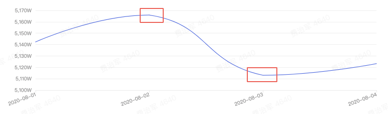
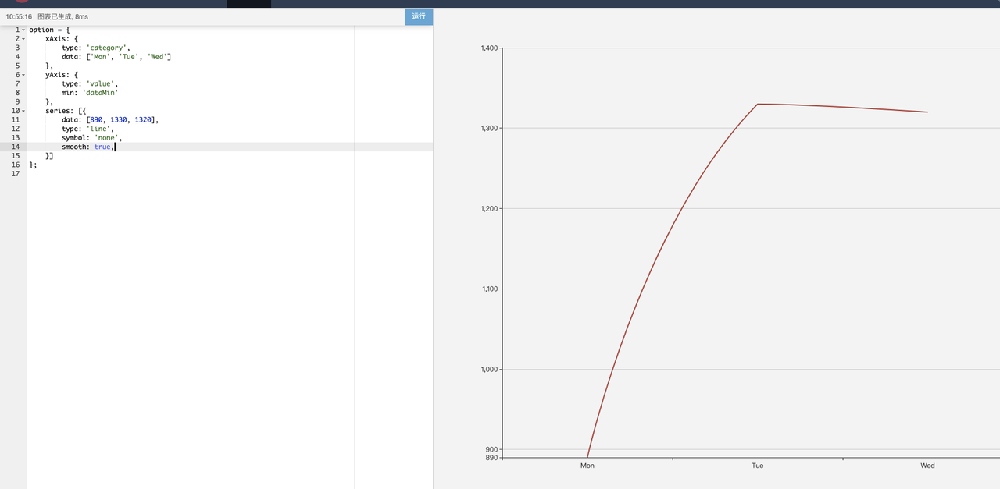
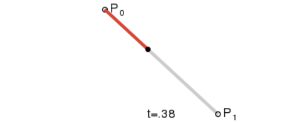
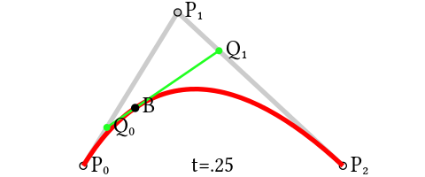
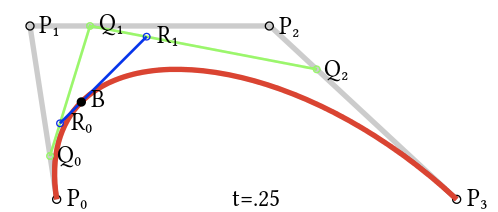
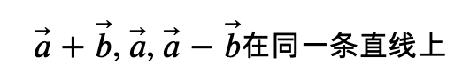
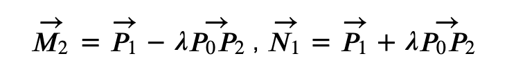
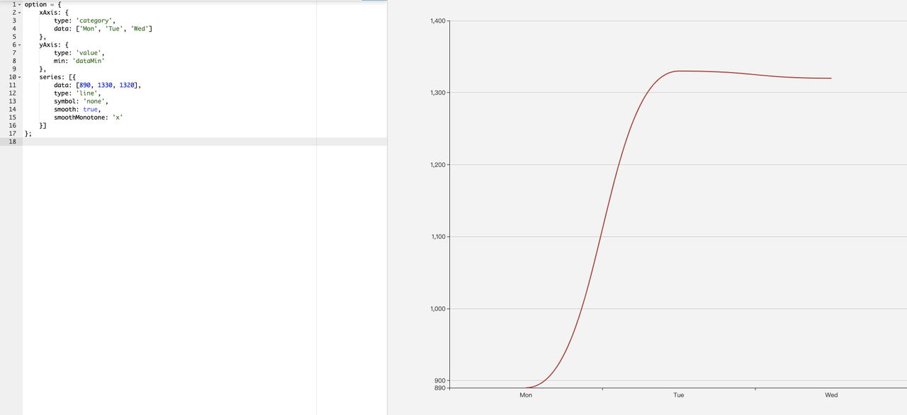

# Echarts 平滑曲线端点为什么不平滑

## 背景

在实际开发中，偶尔会出现曲线是圆滑的，但是端点连接处不是平滑的现象，这种情况往往在选择日期较少，端点两边的曲线斜率相对值差别较大时出现。



使用 Echarts 的在线编辑可以很容易复现出来。



## 背景知识

在展开具体分析之前，我们先介绍一下背景知识。 我们先想一下如何在两点之间画一条曲线，比较简单的方法就是画一个圆弧，假设两点在同一个圆上，那么我们就可以求出这个圆的方程，进而在画布上绘制出这个圆弧。但是如果现在有 3 个点，我们想要用曲线来表示这 3 个点之间的变化趋势，使用圆弧来表示这种变化趋势是不合适的，实际上，太过规则的曲线都不适合用来表达这种多个点之间的变化趋势。

### 贝塞尔曲线

贝塞尔曲线是一种不规则的曲线，它可以在两点之间画出来一条不规则的曲线。在图表可视化中，往往会使用贝塞尔曲线进行绘制平滑曲线。 贝塞尔曲线的绘制过程取决于两个端点以及控制点。

1. 对于一维贝塞尔方程来说，控制点的个数是 0\(维数-1\)个，一维贝塞尔曲线是一条直线，假设两个端点为 P0，P1，方程满足 B\(t\) = P0 + \(P1 - P0\) \* t，t 的取值范围是\[0, 1\]。



1. 对于二维贝塞尔曲线来说，控制点的个数是 1 个，在下图中，满足：



* 由 P0 至 P1 的连续点 Q0，描述一条线性贝塞尔曲线。
* 由 P1 至 P2 的连续点 Q1，描述一条线性贝塞尔曲线。
* 由 Q0 至 Q1 的连续点 B（t），描述一条二次贝塞尔曲线。 即 Q0 在 P0P1 上满足一维贝塞尔曲线；Q1 在 P1P2 上满足一维贝塞尔曲线；并且 B 在 Q0Q1 上满足一维贝塞尔曲线，Q0Q1 是曲线的切线。
* 对于三维贝塞尔曲线来说，控制点是两个，我们可以用递归的思想来看这个三维的贝塞尔曲线：  首先 Q0，Q1，Q2 分别满足在各自线段上的一维贝塞尔方程，然后，使用 Q0，Q1，Q2 再进行二维贝塞尔曲线的进行线性插值，二维曲线又可细化为一维贝塞尔曲线。

### 向量



## Echarts 平滑曲线绘制

### 常规绘制方法

Echarts 在进行常规曲线绘制时，会使用三维贝塞尔曲线进行绘制，所以每次绘制两个点之间的曲线时，需要选定两个控制点。 假设我们现在有 3 个点：P0，P1，P2。P1 点在 P0 点和 P2 点的中间，当绘制 P0 和 P1 点的曲线时，选定两个控制点 M1，M2；在绘制 P1 和 P2 的曲线时，选定两个控制点 N1，N2。那么，如果保证 M2，P1，N1 三点。如下图： 但是 Echarts 在实际处理中，计算得出控制点 M1，M2 后，还会与所有点的中的最大最小 x，y 坐标进行判断并调整，确保控制点不超过这个区域。控制点 M2 与控制点 N1 的计算方式非常相似：



在不对 M2，N1 进行调整的情况下，这两点与 P1 一定在同一条直线上，因此 P1 上的两侧曲线也应该是平滑过度的，不会出现突变的情况。但是由于 Echarts 中多了一步对所有点的中的最大最小 x，y 坐标进行判断并调整的步骤，因而导致 M2，N1 中的其中一个点或者两个点的坐标发生改变，因而造成三点不同线，使得端点两侧线段在端点处的切线发生突变。

### 新算法

Echarts 新使用的算法是将每个控制点两边都保持水平或竖直，水平还是垂直取决于数据点是在哪个方向\(x/y\)上单调递增。这样的好处是，每个点都是连续并且存在导数，生成的曲线是可导的，不会产生突变的情况。缺点是没法处理不单调的情况（比如点坐标依次是：\[100, 100\], \[200, 200\], \[150, 180\]）。新算法的开启可以使用 smoothMonotone 字段，效果如下：



## 参考

1. Echarts 判断使用何种方式进行绘制曲线

```javascript
function drawSegment(
  ctx,
  points,
  start,
  segLen,
  allLen,
  dir,
  smoothMin,
  smoothMax,
  smooth,
  smoothMonotone,
  connectNulls
) {
  if (smoothMonotone === "none" || !smoothMonotone) {
    // 常规方法
    return drawNonMono.apply(this, arguments);
  } else {
    return drawMono.apply(this, arguments);
  }
}
```

1. Echarts 常规绘制圆滑曲线方法

```javascript
// Draw smoothed line in non-monotone, in may cause undesired curve in extreme
// situations. This should be used when points are non-monotone neither in x or
// y dimension.
function drawNonMono(
  ctx,
  points,
  start,
  segLen,
  allLen,
  dir,
  smoothMin,
  smoothMax,
  smooth,
  smoothMonotone,
  connectNulls
) {
  var prevIdx = 0;
  var idx = start;
  for (var k = 0; k < segLen; k++) {
    // segLen：points长度
    var p = points[idx];
    if (idx >= allLen || idx < 0) {
      // points数组下标越界
      break;
    }
    if (isPointNull(p)) {
      if (connectNulls) {
        //connectNulls为true时会跳过这个值，将前一个值和后一个值相连
        idx += dir; // dir === 1
        continue;
      }
      break;
    }

    if (idx === start) {
      // 起始点：移动到该点；非起始点：画线
      ctx[dir > 0 ? "moveTo" : "lineTo"](p[0], p[1]);
      v2Copy(cp0, p);
    } else {
      if (smooth > 0) {
        // 是否平滑绘制
        var nextIdx = idx + dir;
        var nextP = points[nextIdx];
        if (connectNulls) {
          // Find next point not null
          while (nextP && isPointNull(points[nextIdx])) {
            nextIdx += dir;
            nextP = points[nextIdx];
          }
        }

        var ratioNextSeg = 0.5;
        var prevP = points[prevIdx];
        var nextP = points[nextIdx];
        // Last point
        if (!nextP || isPointNull(nextP)) {
          v2Copy(cp1, p);
        } else {
          // If next data is null in not connect case
          if (isPointNull(nextP) && !connectNulls) {
            nextP = p;
          }

          vec2.sub(v, nextP, prevP); // v = nextP - prevP

          var lenPrevSeg;
          var lenNextSeg;
          if (smoothMonotone === "x" || smoothMonotone === "y") {
            var dim = smoothMonotone === "x" ? 0 : 1;
            lenPrevSeg = Math.abs(p[dim] - prevP[dim]);
            lenNextSeg = Math.abs(p[dim] - nextP[dim]);
          } else {
            lenPrevSeg = vec2.dist(p, prevP);
            lenNextSeg = vec2.dist(p, nextP);
          }

          // Use ratio of seg length
          ratioNextSeg = lenNextSeg / (lenNextSeg + lenPrevSeg);

          scaleAndAdd(cp1, p, v, -smooth * (1 - ratioNextSeg));
        }
        // Smooth constraint，造成不平滑的原因
        vec2Min(cp0, cp0, smoothMax); // cp0 = min(lastP, smoothMax)
        vec2Max(cp0, cp0, smoothMin); // cp0 = max(cp0, smoothMin)
        vec2Min(cp1, cp1, smoothMax); // cp1 = min(modifiedP, smoothMax)
        vec2Max(cp1, cp1, smoothMin); // cp1 = max(cp1, smoothMin)

        ctx.bezierCurveTo(
          // 控制点1: cp0；控制点2: cp1；终点：p
          cp0[0],
          cp0[1],
          cp1[0],
          cp1[1],
          p[0],
          p[1]
        );
        // cp0 of next segment
        scaleAndAdd(cp0, p, v, smooth * ratioNextSeg);
      } else {
        ctx.lineTo(p[0], p[1]);
      }
    }

    prevIdx = idx;
    idx += dir;
  }

  return k;
}
```

1. Echarts 计算平滑曲线新算法

```javascript
// Draw smoothed line in monotone, in which only vertical or horizontal bezier
// control points will be used. This should be used when points are monotone
// either in x or y dimension.
function drawMono(
  ctx,
  points,
  start,
  segLen,
  allLen,
  dir,
  smoothMin,
  smoothMax,
  smooth,
  smoothMonotone,
  connectNulls
) {
  var prevIdx = 0;
  var idx = start;
  for (var k = 0; k < segLen; k++) {
    var p = points[idx];
    if (idx >= allLen || idx < 0) {
      break;
    }
    if (isPointNull(p)) {
      if (connectNulls) {
        idx += dir;
        continue;
      }
      break;
    }

    if (idx === start) {
      ctx[dir > 0 ? "moveTo" : "lineTo"](p[0], p[1]);
    } else {
      if (smooth > 0) {
        var prevP = points[prevIdx];
        var dim = smoothMonotone === "y" ? 1 : 0;
        // Length of control point to p, either in x or y, but not both
        var ctrlLen = (p[dim] - prevP[dim]) * smooth;
        v2Copy(cp0, prevP);
        cp0[dim] = prevP[dim] + ctrlLen;
        v2Copy(cp1, p);
        cp1[dim] = p[dim] - ctrlLen;
        ctx.bezierCurveTo(cp0[0], cp0[1], cp1[0], cp1[1], p[0], p[1]);
      } else {
        ctx.lineTo(p[0], p[1]);
      }
    }

    prevIdx = idx;
    idx += dir;
  }

  return k;
}
```

