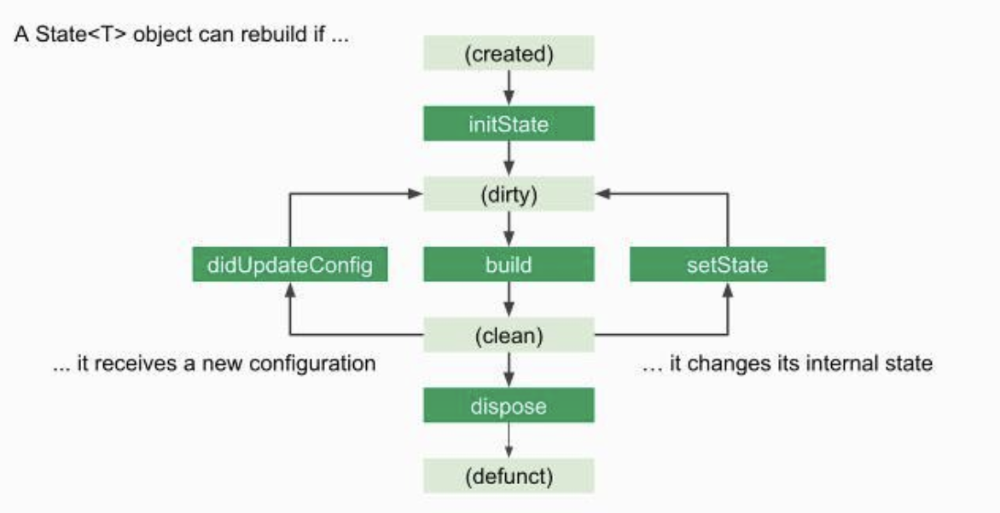
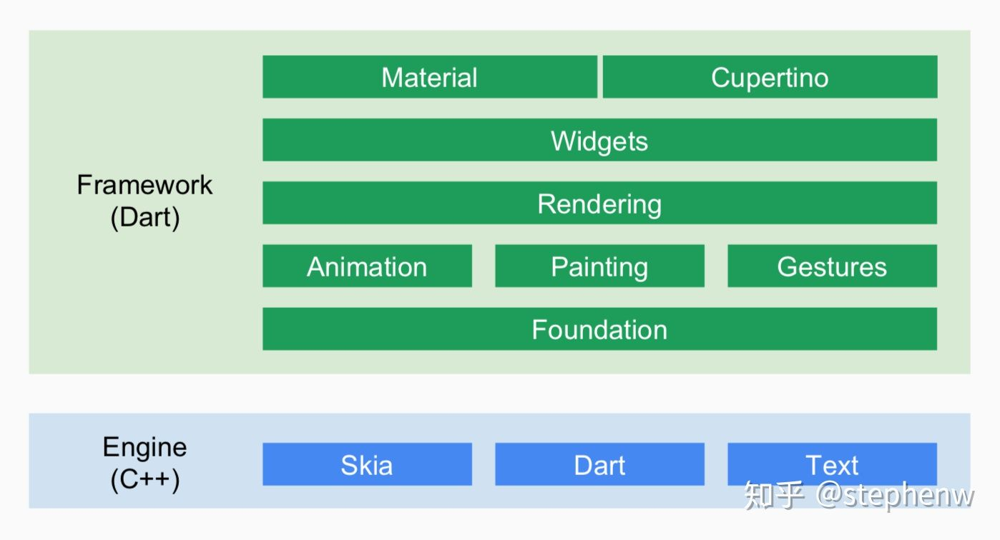

# Flutter 介绍

Flutter 是 Google 推出并开源的移动应用开发框架，主打跨平台、高保真、高性能。开发者可以通过 Dart 语言开发 App，一套代码同时运行在 iOS 和 Android 平台。 Flutter 提供了丰富的组件、接口，开发者可以很快地为 Flutter 添加 native 扩展。同时 Flutter 还使用 Native 引擎渲染视图，这无疑能为用户提供良好的体验。

## Flutter 优势

### 跨平台

首先 Flutter 的最大特点就是跨平台开发，而且是目前支持平台最多的框架。除了 iOS 和 android 之外，还支持 Windows，MacOS，linux 以及谷歌最新操作系统 Fuchsia。

### 内置 MaterialUI

MaterialUI 是一个老牌的 UI 框架，在前端中应用非常广泛。Flutter 里内置了 MaterialUI 风格的组件，可以非常方便的进行使用。使用 Flutter 制作的动画效果也非常顺滑，用户体验做得很好。

### 性能高

Flutter 使用 GPU 渲染，所以性能极高，理论上是能达到 60fps 的传输速率，能完全胜任游戏的制作。使用 Flutter 制作的应用在性能上是可能超过原生应用的。

### Dart

* Dart 的性能更好。Dart 在 JIT 模式下，速度与 JavaScript 基本持平。但是 Dart 支持 AOT，当以 AOT 模式运行时，JavaScript 便远远追不上了。速度的提升对高帧率下的视图数据计算很有帮助。
* Native Binding。在 Android 上，v8 的 Native Binding 可以很好地实现，但是 iOS 上的 JavaScriptCore 不可以，所以如果使用 JavaScript，Flutter 基础框架的代码模式就很难统一了。而 Dart 的 Native Binding 可以很好地通过 Dart Lib 实现。
* Fuchsia OS。Fuchsia OS 内置的应用浏览器就是使用 Dart 语言作为 App 的开发语言。而且实际上，Flutter 是 Fuchisa OS 的应用框架概念上的一个子集。
* Dart 是类型安全的语言，拥有完善的包管理和诸多特性。Google 召集了如此多个编程语言界的设计专家开发出这样一门语言，旨在取代 JavaScript，所以 Fuchsia OS 内置了 Dart。Dart 可以作为 embedded lib 嵌入应用，而不用只能随着系统升级才能获得更新，这也是优势之一。

## 组件

Flutter 在许多理念上与前端的框架比如 React 和 Vue 是不谋而合的，所以 Flutter 也是使用大前端发展跨端能力的一个框架。类似 React 中组件是组建 APP 的基础，Flutter 中也是组件是构建 APP 的基础构建块。

Flutter 对于组件的定义更加宽泛，除了在 UI 上的组件，Flutter 中的样式/布局/动画以及手势处理都是组件的概念。

Flutter 与 React 比较相似，可以通过组件的嵌套构建出来更加复杂的组件。Flutter 组件也分成两种：无状态组件和有状态组件。这两个组件的区别在于 UI 是否会改变。如果界面是一成不变的，比如 Text 和 Image，那么就是无状态组件，反之，像滑动/动画是有状态组件。状态存储在组件的 State 中，可以使用 setState 来改变 State。

State 是组件的 UI 数据模型，是组件渲染时的数据依据。Flutter 内的组 State 类似一个状态机，用户的操作/网络请求/系统事件都会推动状态机向下一个状态改变。Flutter 的组件生命周期如下：

### Flutter 系统架构

Flutter 的系统设计结构如下：

1. Flutter Framework

Flutter Framework 是一个纯 Dart 实现的 SDK，类似于 React 在 JavaScript 中的作用。它实现了一套基础库， 用于处理动画、绘图和手势。并且基于绘图封装了一套 UI 组件库，然后根据 Material 和 Cupertino 两种视觉风格区分开来。这个纯 Dart 实现的 SDK 被封装为了一个叫作 dart:ui 的 Dart 库。我们在使用 Flutter 写 App 的时候，直接导入这个库即可使用组件等功能。

Framework 的最底层叫做 Foundation，其中定义的大都是非常基础的、提供给其他所有层使用的工具类和方法。绘制库（Painting）封装了 Flutter Engine 提供的绘制接口，主要是为了在绘制控件等固定样式的图形时提供更直观、更方便的接口，比如绘制缩放后的位图、绘制文本、插值生成阴影以及在盒子周围绘制边框等等。Animation 是动画相关的类，提供了类似 Android 系统的 ValueAnimator 的功能，并且提供了丰富的内置插值器。Gesture 提供了手势识别相关的功能，包括触摸事件类定义和多种内置的手势识别器。GestureBinding 类是 Flutter 中处理手势的抽象服务类，继承自 BindingBase 类。Binding 系列的类在 Flutter 中充当着类似于 Android 中的 SystemService 系列（ActivityManager、PackageManager）功能，每个 Binding 类都提供一个服务的单例对象，App 最顶层的 Binding 会包含所有相关的 Bingding 抽象类。如果使用 Flutter 提供的控件进行开发，则需要使用 WidgetsFlutterBinding，如果不使用 Flutter 提供的任何控件，而直接调用 Render 层，则需要使用 RenderingFlutterBinding。

1. Flutter Engine:

Flutter Engine 是一个纯 C++实现的 SDK，其中囊括了 Skia 引擎、Dart 运行时、文字排版引擎等。不过说白了，它就是 Dart 的一个运行时，它可以以 JIT、JIT Snapshot 或者 AOT 的模式运行 Dart 代码。在代码调用 dart:ui 库时，提供 dart:ui 库中 Native Binding 实现。这个运行时还控制着 VSync 信号的传递、GPU 数据的填充等，并且还负责把客户端的事件传递到运行时中的代码。

