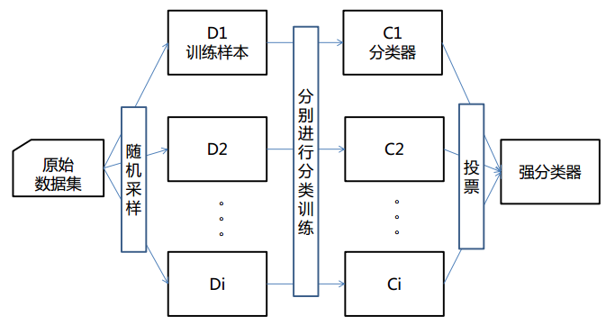
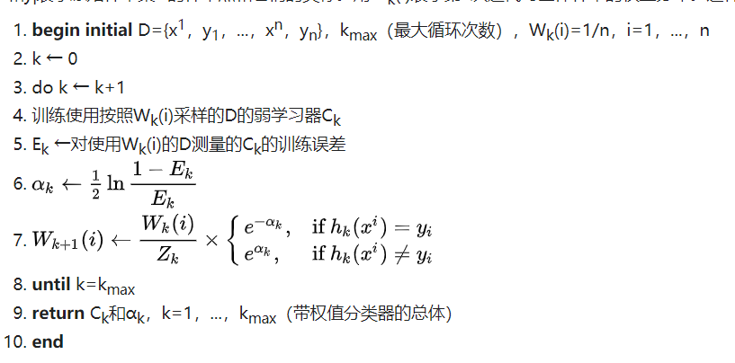
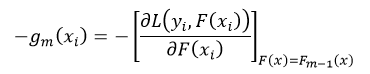
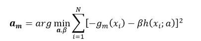
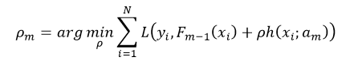
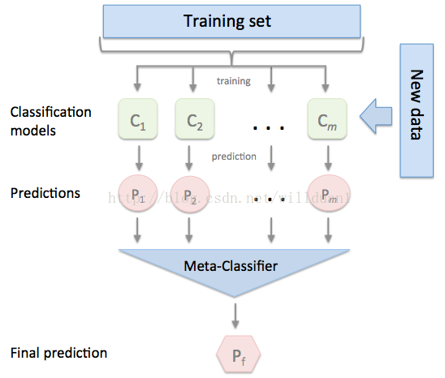

# 集成学习算法

目前，深度学习是学术界和工业界最为热门的机器学习研究领域，在之前我们也总结了很多深度学习领域的模型和算法。然而在实际应用中，将大规模的数据灌输给神经网络然后随意地调整网络层数和结构的做法，常常是无法接受的。

原因就在于深度学习的一些众所周知的缺点：可解释性弱、需要大量数据、容易发生过拟合。因此一些非深度学习的机器学习算法依然有着广泛的应用以及良好的性能。本次我们介绍的集成学习（Ensemble Learning\) 算法就是其中一类。后续也会陆续介绍其他几类常见的算法。

## 集成学习简介

集成学习简单来说，就是用某种方法将若干个弱模型组合起来形成一个既有良好的性能又可以在不同数据集上有较好的泛化效果和较低方差的强模型。

各种集成学习的方法的区别和设计关键点有三个：

* 用什么数据来训练每一个弱模型？
* 如何训练每一个弱模型？
* 如何总结多个弱模型的结果产生最终结果？

由于集成学习常被用在分类问题中，为了方便我们在后面把模型都统称为分类器。

根据策略的不同可以将集成学习分为以下几类

## Bagging

又称装袋算法，其实是英文Bootstrap aggregating的缩写。由Leo Breiman于1994年提出。

基本原理是随机地有放回地从整个数据集中采样n次，得到n个子数据集，这个步骤称为Bootstrap。然后用子数据集分别训练n个子分类器。最后将n个子模型地预测结果通过平均数、少数服从多数投票等方法集成出一个最终结果。

## Boosting

提升算法。和bagging不同，每个弱模型都是用数据集的全集来训练的。另一个与bagging不同的点就在于每个弱分类器的权重是不同的。这个权重往往受到模型的训练效果影响。

Boosting在实际应用中是集成学习算法中最为成功的一类。在前几年也有关于Boosting算法的新型设计出现，XGBoost、lighGBM已经成为算法大赛中广受参赛者青睐的算法。下面我们对几种boosting算法做一个简单介绍。

## AdaBoost

AdaBoost是最为经典的Boosting算法之一，某种意义上已经成为了boosting算法的代称。除了根据每个分类器的分类准确度调整各个弱分类器的权重外，AdaBoost还会赋予每个数据样本权重。 整个算法的流程就是，刚开始训练时对每一个数据样本赋相等的权重，然后用弱分类器对训练集训练t轮，每次训练后，对训练失败的样本赋以较大的权重，也就是让下一个分类器在训练时更注意学错的样本。这样得到的若干个弱分类器对于数据集中的样本各有偏重，也就更加能够拟合出正确的结果。

## GBDT

GBDT其实是Gradient Boosting用决策树（Decision Tree\)作为弱分类器的算法，由于这个组合比较常见，因此统称为GBDT。

每一个分类器的训练目标函数，实际上是过去所有的弱分类器集成之后和标签的梯度。形象地说，这就像是一场接力赛，最终目标是要达到标签值，每个弱分类器就是要在当前跑过的距离基础上更进一步。 

将该负梯度作为当前轮参数拟合的目标，如果以平方差损失函数为例，则拟合过程为： 

对于每一轮的学习速率，通过一个参数𝜌𝑚来计算，使其满足： 

相比于 Adaboost，GBDT能同时适用于分类问题和回归问题，也可以根据需要使用多种损失函数，缺点是由于弱学习器之间的线性依赖关系，难以通过并行的方式提高速率；在数据量和数据维度较大的情况下生成决策树的计算复杂度非常高。

XGBoost等算法设计较为复杂，机制也比较丰富，我们将在之后另开专题介绍。

## Stacking

Stacking方法是指训练一个模型用于组合其他各个模型。首先我们先训练多个不同的模型，然后把之前训练的各个模型的输出为输入来训练一个模型，以得到一个最终的输出。可以看作就是解决另一个分类问题：在多个分类器中应该选择哪一个作为正确结果。我们将这个分类器称为元分类器（meta-classifier\)

## 集成学习的注意事项

集成学习对数据集和弱分类器的选择具有较高的要求：

* 数据集要尽量保证正确。集成学习对错误标签的容忍度较低，因为弱分类器可能很容易因为一个错误标签被导向错误的方向，进而影响整体训练效果。数据集可以小但是必须准确。
* 分类器不能太强。弱分类器必须比较弱，保证不存在过拟合，甚至可以容忍欠拟合。因此集成学习不能和深度学习相结合。用深度学习模型作为集成学习的弱分类器只会适得其反，不符合其基本理论。

