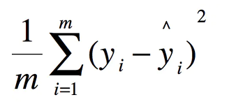
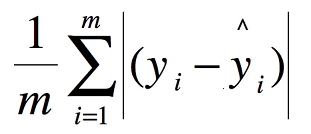
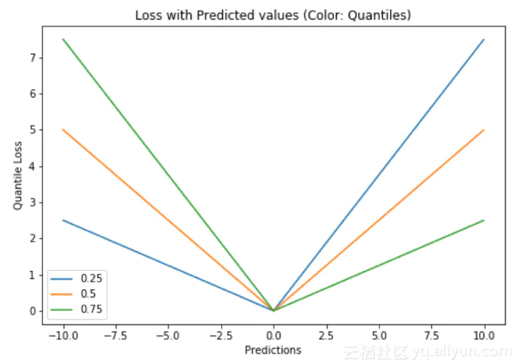
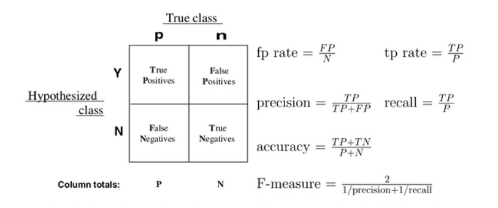
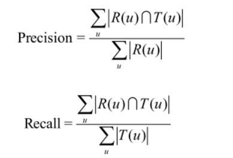

# 机器学习常见评价指标

## 评价指标

评价指标是指机器学习中对于训练好的模型效果进行定量评价的指标。

一个机器学习模型的形成过程中总是会经历训练到测试的过程，其中训练过程中的损失定义和优化方法是非常多变的，但在测试过程中机器学习的评价指标是比较统一的，这也方便了开发人员对模型的能力进行比较，找出最佳的模型。

根据机器学习任务的不同，在分类问题和回归问题中我们通常会采用不同的指标评估方法，此外在一些特殊领域，如推荐系统也有一些独特的评价指标。

## 回归问题

回归（Regression）问题通常指的是标签为连续值的机器学习问题。由于预测值是连续的，因此计算预测效果较为简单，只需要以某种方式来体现预测值和标签之间的差值即可，差值越小，则模型效果越好。

### MSE

MSE（mean squared error）均方误差是回归问题中最常见的评价指标，其计算方式是预测值和ground truth之间差值的平方均值。这个评价指标的主要好处在于和训练过程中常用的L2损失函数一致，可以很容易比较模型在训练集和数据集上的效果差距。

### RMSE

RMSE（root mean squared error）均方根误差也是一种常见的评价指标，与MSE的区别在于添加了一个取平方根的计算，主要目的在于将误差值换算到和标签值相同的量纲上，便于描述误差。

### MAE

MAE（mean absolute error）与RMSE类似，取误差值绝对值的平均值，作用与RMSE类似，需要注意的是一般不会将MAE用在训练过程中，这是因为绝对值函数的梯度下降不稳定。

### Quantile Loss

分位数函数是对于MAE的扩展，其中参数gamma为分位数，当gamma取0.5时分位数损失等价于MAE损失。

当gamma取大于或小于0.5的值时，意味着更看重大于或小于标签的预测的损失。例如，当gamma取0.75时，那些大于真实标签的预测值将会给损失函数提供更大的价值。

下图可以帮助我们更好理解在gamma取不同值时，预测的结果对于损失函数计算结果的影响。

## 分类问题

与回归问题相比，分类问题的评价指标较为直观，基本都是围绕着混淆矩阵（confusion matrix）展开的，如下所示：

* True Positive（TP）：预测为正例，实际为正例
* False Positive（FP）：预测为正例，实际为负例
* True Negative（TN）：预测为负例，实际为负例
* False Negative（FN）：预测为负例，实际为正例

accuracy可以理解为预测正确的样本占所有样本的比例

* accuracy = \(TP + FN\) / \(TP + FP + TN + FN\)

recall可以理解为预测正确的正例占实际所有正例的比例，precision可以理解为预测正确的正例占预测的所有正例的比例。

* recall = TP / \(TP + FN\)
* precision = TP / \(TP + FP\)

recall precision等指标与实际应用场景息息相关。实际问题中，我们对于正例和负例的预测能力需求实际上是不一致的，有时我们希望模型不要将负样本预测成正样本，但是可以容忍模型将正样本预测成负样本，有时则正好相反。

以上的指标大多可以直接拓展到多分类的场景中。需要注意除了accuracy，其他指标必须将多分类问题转化为one vs all的问题再计算。

## 推荐系统

推荐系统的场景是，模型根据已有信息对特定用户给出推荐物品列表。

根据输入信息和预测目标的不同，推荐系统问题可以分为explicit feedback和implicit feedback两种。

* Explicit feedback指的是用户对物品有明确的打分，测试时会给出user、item对，由模型预测评分
* Implicit feedback指的是用户对物品只有点击、关注、收藏等交互行为，测试时直接要求模型根据用户id给出一系列的推荐物品。

由于explicit feedback问题中存在评分这一连续指标，因此可以直接应用回归问题中的RMSE等指标。但目前主要研究的热点在于implicit feedback问题，主要有以下评价指标。

### Hit Rate

Hit Rate 对应的是leave one out的测试场景。例如用户u点击过n个物品，则取前n-1个物品作为训练集，最后1个用于测试。

模型在测试中将给出一个长度为k的推荐列表，当列表中有测试集中对应的物品时，则说明预测成功。

最终平均所有用户的测试结果计算出的值为 Hit Rate@k，一般来说在k越小的时候，模型取得较高hr的难度越大。

### recall和precision

这两个指标对应的是在测试集中划入多个物品的测试场景。例如用户u点击过n个物品，则取前70%的物品作为训练集，后30%用于测试。

公式中R集合表示模型给出的长度为k的推荐列表，T集合表示测试集中实际的物品集合

recall和precision与在分类问题中的定义类似。recall表示预测正确的物品占测试集物品的比例，precision表示预测正确的物品占推荐列表长度的比例。

hit rate相当于recall在测试集长度为1时的特殊情况。

### NDCG

前文所提到的推荐列表实际上是一个有序的序列，模型会将更加可能被用户接受的物品放在更前面。因此我们也需要一个指标来评判模型是否把正确的物品放在了更加前面的位置。

DCG（Discounted cumulative gain）。公式中p对应推荐列表的长度，reli表示某个位置item和user的相关度，也就是该item被用户接受的程度。下面的对数其实是表示该位置所占权重，位置越靠后则权重越低。

之后我们会计算iDCG，计算方式与DCG类似。两者不同之处在于DCG中对应的是模型给出的排列顺序，iDCG则是依据reli从大到小重新排序排序的理想推荐顺序。

换言之如果按照iDCG的中的顺序，最好的item总是最先被推荐给用户，是一种理想状态。

* nDCG = DCG / iDCG

很明显nDCG是一个比值，表示实际的推荐顺序与理想推荐顺序的相符程度，nDCG越大则推荐顺序越理想。

