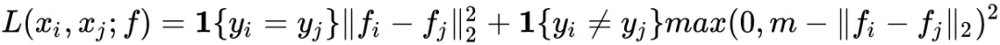
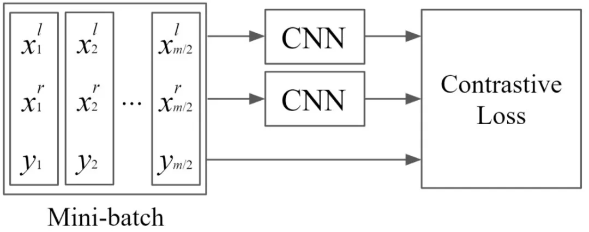
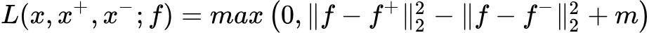
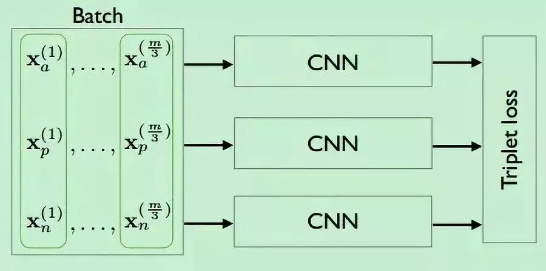
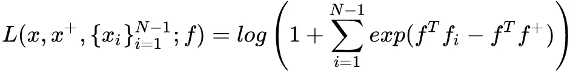
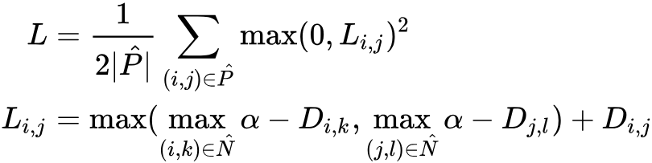

# 深度度量学习

度量学习\(Metric Learning\)是一种机器学习方法。我们知道在一般的机器学习中，需要学习的就是一种从输入到输出的映射关系或者函数。在衡量学习效果时，需要使用loss函数来判断模型给出的预测结果是否在数值上接近实际值或者在分类上是否和实际相符。

度量学习的学习目标是一种距离函数，这个函数可以很好地表达不同样本之间的相似性或者差异。而深度度量学习则更进一步，学习将样本特征映射到某个嵌入空间\(embedding space\)上的方法。

实际使用中，深度度量学习常常起到一种降维或者特征提取的作用，也有些问题可以直接使用度量学习的结果进行预测\(如推荐系统中的BPR算法\)

## 损失函数和采样方法

对于深度度量学习而言，最重要的部分就是损失函数的设计。和一般的机器学习方法不同，度量学习的基本思路是选取标签不同的样本对使他们的距离增大，或者选取标签相同的样本对使他们的距离减小。

首先需要定义距离函数或者相似度函数。如果使用距离函数，则函数值越大表示两个向量之间越不相似。如果使用相似度函数则恰恰相反。

主要有以下几种：

```python
import numpy as np

# 随机定义A, B 两个向量
A = np.random.randn(10)
B = np.random.randn(10)

# 欧几里得距离(Euclidean distance)
dist = np.square(np.sum(A - B)**2)

# 曼哈顿距离(Manhattan distance)
dist = np.sum(np.abs(A - B))

# 切比雪夫距离(Chebyshev distance)
dist = np.max(np.abs(A - B))

# cosine距离
similarity = (np.sum(A * B))/(np.linalg.norm(A)) / (np.linalg.norm(A))
```

基于这些距离函数，就可以判断模型得到的样本嵌入向量之间的相似性。但是在实际场景中，样本量通常都非常巨大，很难穷尽所有的样本，实际经验中不少样本信息量很少，对度量学习的准确性增益有限。

因此要想实现有效的度量学习还需要精心设计采样方法和损失函数，尽可能保证使用信息量较高的样本\(称为困难样本挖掘，hard sample mining\)，损失函数能够尽可能保证学习效果。

采样方法和特定的损失函数往往是相辅相成，配套使用的。

## Contrastive loss & Triplet loss

Contrastive loss是最简单的损失函数，方法是从数据集中随机采样两个样本，如果两者标签一致则减小两者间的距离，反正增大两者的距离，但要用一个m作为边界，避免正负样本间的距离过大。\(这个margin在其他损失函数中也很常见，是为了保证模型的鲁棒性和泛化能力\)



以图片分类问题为例，流程图如下所示：



Contrastive loss是最基本的度量学习思路，但他的缺点也很明显，两个样本间的距离缺乏参照性。例如两个正样本之间的距离可能在优化后仍然大于正负样本间的距离。

在上述思路的启发下产生了被称为三元组损失函数的Triplet loss。其公式如下：



其中每次训练选取的是三个样本，第一个样本作为锚点，第二个样本和锚点标签一致，第三个样本和锚点标签不一致。损失函数保证锚点和负样本的距离大于锚点和正样本的距离。



三元组保证了正样本间的距离与正负样本间的距离差大于m，这考虑到了相对的距离关系。然而，这两种 Loss 函数如果单独使用则会遭遇收敛速度慢的问题。在学习过程的后期，大多数样本都能满足损失函数的约束条件，这些样本对应进一步学习的贡献很小。

此外上述两种方法主要还是运用于二分类的问题，在多分类问题中的效果有限。

## N-pair-ms loss & Lifted struct loss

本节中的两个损失函数均是对Triplet损失函数的优化。

N-pair-ms 损失函数主要是考虑到多分类问题中包含不止一个其他类的负样本的情况。公式如下所示：



公式中xi相对于x来说均是标签不一致的样本。该损失函数试图从一个batch中增大x和所有对于x的负样本和对于x的正样本之间的距离差。f是样本到隐藏空间的映射函数。

Lifted struct loss是基于训练中每个batch动态生成三元组的算法。公式如下



其中，P是正样本对\(pair的左变量和右边量来自同一个类\)的集合；N是负样本对的集合； Di,j 是样本对{i,j}的距离。

对于每一个正样本对 {i,j}，模型分别挖掘其左变量i和右变量j对应的最困难的负样本，独立地找到距离左变量最近的负样本，假设为k；同时找到距离右边量最近的负样本，假设为l。接着通过比较 Di,k 和 Dj,l，找出其中较小的距离对应的负样本，假设为n。

最后，根据最困难的三元组计算三元组{i，j，n} 确定的triplet loss函数。

