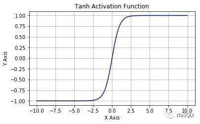
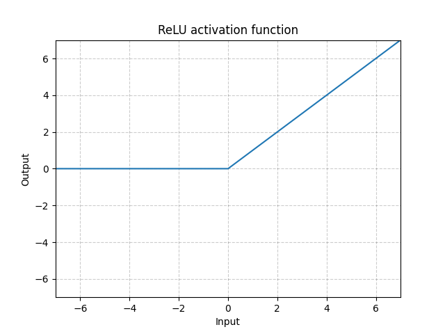
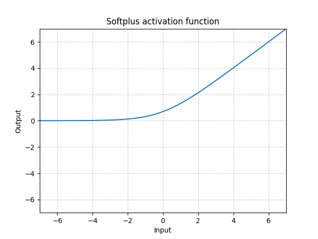
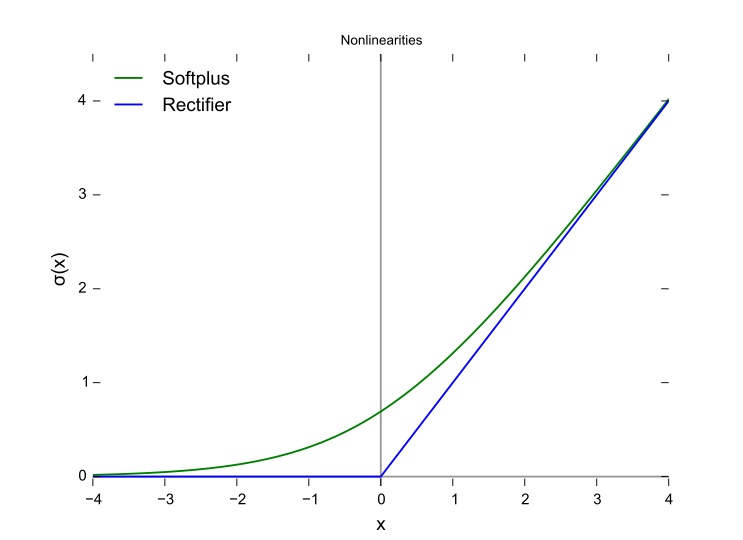

# 深度学习常用激活函数

在机器学习过程中会用到一些常用函数，这些函数的推导和证明是数学领域的内容，如果作为一个使用者，我们往往只需要了解其性质和使用场景。

在之前有介绍过在模型效果评估，也就是测试部分用到的一些函数如MSE、RMSE等。本篇主要是介绍深度学习的神经网络中需要用到的激活函数。

激活函数的主要目的是为线性网络赋予非线性表达的能力，也有一些激活函数主要是用于实现一些特殊的模型预测功能或者网络结构。

## sigmoid和softmax

sigmoid和softmax是在分类问题中最为常见的两种激活函数。两者的表达式分别为：


softmax函数的参数是一个vector, 该函数根据向量中每个值计算以e为底的指数，然后总体做一个标准化也就是使得向量的和为1。

因此这个函数特别适用于在分类问题中将网络的输出结果转化为对每个类的概率值，并且使得这些概率之和为1.


从公式可以看出其实sigmoid可以算是softmax函数在二分类问题中的特例。该函数以一个值为输入，将会把输入转化为0-1范围内的概率值，因此适用于二分类问题。

其函数曲线如图所示：


在实际使用中我们经常也会使用sigmoid函数来实现一个可导的将网络中的输出值限制到\(0,1\)范围内，以便能够求导更新网络。

在torch中可以直接调用这两个常用的函数，如下：

```python
import torch

x = torch.randn(5, 5)

sigmoid_result = torch.sigmoid(x) # 对x中的每个元素进行sigmoid计算

softmax_result = torch.softmax(x, dim=1) # 对x在第1个维度上执行softmax计算，即使得每一行值和为1。
                                        # 可以通过设置dim值改变softmax的方向
```

## tanh

tanh是双曲函数中的一个，tanh\(\)为双曲正切。在数学中，双曲正切“tanh”是由基本双曲函数双曲正弦和双曲余弦推导而来。

其表达式为：


曲线图如图所示：



tanh的提出主要是为了解决循环神经网络\(RNN\)中的梯度消失问题，可以看出其实tanh曲线的变化和sigmoid类似，但是它的梯度更大，输出结果的范围也进一步扩展到了\(-1, 1\)

然而tanh目前主要的用途也仅限于rnn,这是因为后面开发出了效果更加优秀的激活函数如softplust和relu。

同样的tanh也被用于进行一些可导的限制到\(-1， 1\)范围内的操作。

```python
import torch
import torch.nn as nn

x = torch.randn(5, 5)

tanh_result = torch.tanh(x) # 对x中的每个元素进行tanh计算

tanh = nn.Tanh() # 设置一个tanh层，常见于网络的构建中，实际上也可以动态的调用上述函数来实现，两者基本等价
```

## ReLU和softplus

ReLU全称为线性整流单元\(Rectified Linear Unit, ReLU\)，虽然有着一个抽象的名字，但是它的公式其实非常简单：


其实就是一个在大于0的区间取原值，在小于等于0的区间取0的分段函数，但是这个函数却完美地实现了非线性表示能力，并且相比于sigmoid、tanh等函数提高了计算效率。

曲线图如下：



ReLU函数并不是处处可导的，在x=0处不可导，大多数深度学习框架往往会默认在0的位置设置导数为0。此外可以看出在小于0的部分，导数恒为0。相当于会强制模型的小于0的部分输出为0，并且不做梯度更新。

某种程度上ReLU这样的操作会使得模型参数减少，从而降低模型的过拟合风险，同时也可以缓解梯度消失和梯度爆炸问题。

不过笔者在详细查找之后发现，其实对于ReLU解决梯度消失问题的观点不少研究者仍存在疑问。很明显的问题就是当ReLU接收到的输入都小于0时，输出就会全部变为0，而且时无法通过训练挽回的，这被称作Dead ReLU probleam。

解决方法有两种思路：

1. 进行更加合理的网络参数初始化，避免大量神经元死亡。如Glorot等人提出的Xavier initialization，尽可能让输入输出满足相同分布，成功解决了tanh激活函数的梯度消失问题。何恺明提出的He initialization改善了ReLU的梯度问题。

   目前ReLU + He initialization是深度学习中的常用方法

2. 针对ReLU本身进行修改，使得在x&lt;0的时候的梯度不恒为0。按照这种思路发明了一些ReLU的改进版函数如：Leaky ReLU在x&lt;0时也赋予一个λ作为梯度；Noisy ReLU在上一层网络的基础上添加了一个高斯分布的噪声。这些函数在一些特定的领域取得了良好的效果。

在实际操作中ReLU函数仍然是网络中激活函数的最佳选择。

softplus函数是ReLU的一个近似，其公式为:


笔者在metric learning领域的lifted structured loss中也看到过用平滑版的函数来替代max函数的做法，具体可以参考Oh Song H, Xiang Y, Jegelka S, et al. Deep metric learning via lifted structured feature embedding\[C\]//Proceedings of the IEEE conference on computer vision and pattern recognition. 2016: 4004-4012.

softplus图像为：



和relu画在一起的效果是：



那么是否可以用softplus替代ReLU呢？虽然没有实际的理论验证，但大部分人给出的答案都是否定的，原因无外乎以下两点：

* 经验出发。实际经验中感觉softplus并没有超过ReLU的性能。如Goodfellow等人编写的Deep Learning一书中提到： The use of softplus is generally discouraged. ... one might expect it to have advantage over the rectifier due to being differentiable everywhere or due to saturating less completely, but empirically it does not.

  \(引自[https://stats.stackexchange.com/questions/146057/what-are-the-benefits-of-using-relu-over-softplus-as-activation-functions](https://stats.stackexchange.com/questions/146057/what-are-the-benefits-of-using-relu-over-softplus-as-activation-functions)\)

* 从效率出发。softplus的计算涉及到指数和对数，显然不如ReLU快。作为一个神经网络的训练中需要频繁调用的激活函数，自然ReLU更优。

在PyTorch中由于这两个函数很少用于网络以外的计算中，因此将其包装在torch.nn之下

```python
import torch
import torch.nn as nn
import torch.nn.functional as F

relu = nn.ReLU() # 设置一个ReLU层，常见于网络的构建中，实际上也可以动态的调用上述函数来实现，两者基本等价
relu_f = F.relu()

softplus = nn.Softplus()
softplus_f = F.softplus
```

有传言ReLU和softplus提出后不仅在深度学习上取得了良好效果，更与某些脑神经科学的成果不谋而合。笔者更赞同另一种观点，即深度学习中的一些实验发现某种程度上可以为脑科学提供新颖的思路。目前更好的办法还是将两者分离开来，不应该走上“玄学”的歪路。

