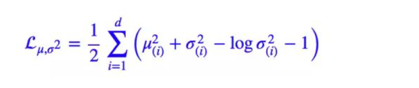

# VAE算法

## VAE算法

在过去我们介绍过VAE是一种用于自动生成图片的算法，可以理解成是对抗生成网络GAN的前身，本次我们对其做详细介绍。

## VAE基本原理

VAE即变分自编码器\(Variational auto-encoder，VAE\)，于2013年由Diederik P.Kingma和Max Welling提出。原论文参见[Auto-encoding variational bayes](https://arxiv.org/abs/1312.6114)

我们知道auto-encoder的基本原理就是将输入x通过encoder映射到一个隐藏层z，然后再将z输入到decoder中重新构建出x'，然后通过损失函数让重构出的x'和x尽可能一致。之后我们就可以利用这种方法学到的参数进行后续工作。


而VAE在Auto-encoder的基础上，试图增加学习到的信息量，使得模型具备以下两种能力。

1. encoder -&gt; 识别模型
2. decoder -&gt; 生成模型

因此VAE对于auto-encoder 最基本的改动就是在隐藏层，将原本固定的一个隐藏向量替换为了一个隐藏向量的正态分布。


图中很明显可以看出隐藏层的z变成了一个正态分布分布，通过z\_mean和z\_log\_var两组变量作为该正态分布的参数。深度学习时代使得我们可以轻易的用两个分立的全连接层对均值和标准差分别进行参数估计。

此处也有两个细节：

1. 该处的log\_var 表示的是方差的e对数，这是因为方差具有必须大于0的特点，如果直接通过神经网络训练还需要添加额外的激活函数，而对数则使得网络输出的范围扩展到了实数域，不需要添加额外的激活函数。
2. decoder的输入来自于z分布的采样，由于采样这个步骤不可导，因此使用了reparemerization的技巧。先从标准正态分布N\(0, 1\)中采样一个epsilon，然后再令z = z\_mean + sigma \* epsilon。

   这个计算过程中会将epsilon作为常数，从而可以将梯度反向传播到z\_mean 和z\_log\_var上。

损失函数设计方面，主要涉及两个部分:

1. 基本的auto-encoder loss，这部分和普通AE相同。
2. KL散度。这部分loss主要目的是为了避免模型的退化。模型有可能会将方差部分全部变为0，从而将模型退化成普通的auto-encoder模型。因此我们限制z的分布和标准正态分布接近。

    即KL\(N\(μ,σ^2\)‖N\(0,I\)



## VAE代码实现

代码主要参考github上AntixK的项目PyTorch\_VAE, 参见[https://github.com/AntixK/PyTorch-VAE/blob/master/models/beta\_vae.py](https://github.com/AntixK/PyTorch-VAE/blob/master/models/beta_vae.py)

如果省略前后的卷积部分，我们会发现VAE的模型在代码实现上其实非常简单。

z\_mean和z\_log\_var的拟合：

```python
    def encode(self, input: Tensor) -> List[Tensor]:
        """
        Encodes the input by passing through the encoder network
        and returns the latent codes.
        :param input: (Tensor) Input tensor to encoder [N x C x H x W]
        :return: (Tensor) List of latent codes
        """
        result = self.encoder(input)
        result = torch.flatten(result, start_dim=1)

        # Split the result into mu and var components
        # of the latent Gaussian distribution
        mu = self.fc_mu(result)
        log_var = self.fc_var(result)
```

reparameter操作：

```python
    def reparameterize(self, mu: Tensor, logvar: Tensor) -> Tensor:
        """
        Will a single z be enough ti compute the expectation
        for the loss??
        :param mu: (Tensor) Mean of the latent Gaussian
        :param logvar: (Tensor) Standard deviation of the latent Gaussian
        :return:
        """
        std = torch.exp(0.5 * logvar)
        eps = torch.randn_like(std)
        return eps * std + mu
```

损失函数：

```python
    def loss_function(self,
                      *args,
                      **kwargs) -> dict:
        self.num_iter += 1
        recons = args[0]
        input = args[1]
        mu = args[2]
        log_var = args[3]
        kld_weight = kwargs['M_N']  # Account for the minibatch samples from the dataset

        recons_loss =F.mse_loss(recons, input)

        kld_loss = torch.mean(-0.5 * torch.sum(1 + log_var - mu ** 2 - log_var.exp(), dim = 1), dim = 0)

        return {'loss': loss, 'Reconstruction_Loss':recons_loss, 'KLD':kld_loss}
```

