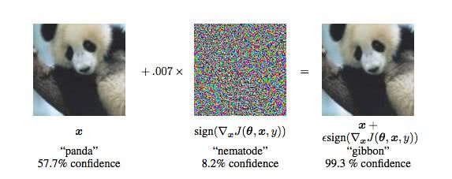
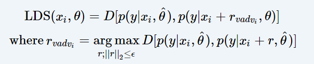

# 虚拟对抗训练

## 对抗训练

对抗训练是一种机器学习的训练方式。在实验中人们发现对抗样本对于机器学习模型，尤其是解释性较弱的深度学习模型影响很大。

典型的例子常见于计算机视觉领域：



在添加噪声前，模型有57.7%的概率将其分类为熊猫。在加上了噪点后，这张图在肉眼看来仍然是熊猫，但机器学习模型却以99.3%的概率将其分类为长臂猿

为了防止模型出错，或者有人利用模型的这种弱点手动产生对抗样本来欺骗模型，研究人员提出在训练中手动添加一些扰动，从而提高模型鲁棒性的方法，这就是对抗训练。

我们可以将对抗训练中计算出的对抗样本的loss理解为给模型额外添加了一个正则项，提升了模型的泛化能力。

## 虚拟对抗训练

虚拟对抗训练（VAT Visual adversarial training）是基于对抗训练改进的一种算法。与对抗训练不同，VAT并不完全依赖于真实标签分布，即使无标签的数据也可以进行VAT。这使得它可以同时被应用在监督学习和半监督学习中。

普通训练、对抗训练、虚拟对抗训练三者的区别，如下所示

* 普通训练：真实样本预测结果 vs 真实标签
* 对抗训练：真实样本预测结果 vs 真实标签 + 对抗样本预测结果 vs 真实标签
* 虚拟对抗训练：真实样本预测结果 vs 对抗样本预测结果（无标签的数据） + 真实样本预测结果 vs 真实标签（有标签数据）

其主要公式如下，VAT将正则项命名为局部分布平滑度（LDS Local distributional smoothness\)



由公式我们可以看出，VAT计算的并不是对抗样本和真实标签之间的loss，而是计算真实样本和对抗样本之间的距离。这也是为什么VAT可以适用于标签缺失的训练任务中。

公式体现出VAT分为两个步骤：

1. 计算扰动rvadvi&lt;/sub&gt; 的值，其目标是使得该扰动在当前的参数下对模型预测结果的影响最大。
2. 根据对抗样本和真实样本分别计算预测值，将两个分布之间的差异作为正则项添加到模型的优化目标中。

## 计算扰动

对于计算扰动的方法，原作者进行了详细的数学论述，在此笔者不多做讨论，感兴趣可参考

* Virtual Adversarial Training: a Regularization Method for Supervised and Semi-supervised Learning - [https://arxiv.org/abs/1704.03976](https://arxiv.org/abs/1704.03976)

具体实践下来，采用的是一种启发式的计算方法，以PyTorch的实现为例。

```python
# 计算rvadv
# ip = 1 xi = 10.0 eps = 1.0
d = torch.rand(x.shape).sub(0.5).to(x.device)
d = _l2_normalize(d)
for _ in range(self.ip):
    d.requires_grad_()
    pred_hat = model(x + self.xi * d)
    logp_hat = F.log_softmax(pred_hat, dim=1)
    adv_distance = F.kl_div(logp_hat, pred, reduction='batchmean')
    adv_distance.backward()
    d = _l2_normalize(d.grad)
    model.zero_grad()

#    
r_adv = d * self.eps
```

首先将d初始化为一个随机的向量，然后不断计算以此产生的对抗样本和真实样本间的lds,然后将d赋值为梯度。

实际经验是迭代一次即可产生较好的近似结果。

## 计算LDS

正如上一节代码中体现的，首先会有一个超参数epsilon来限制rvadvi&lt;/sub&gt;的范围，然后会直接将这个值加到真实样本上得到对抗样本。

在衡量真实样本的预测值和对抗样本的预测值的差异，通常采用计算KL散度的方法。

KL散度即Kullback-Leibler散度，又称相对熵，是一个非对称的差异度量，在PyTorch中可以直接使用torch.nn.functional中的函数进行计算。

* F.kl\_div\(p, q, reduction=mean\)

```python
import torch.nn.functional as F

r_adv = d * self.eps
pred_hat = model(x + r_adv)
logp_hat = F.log_softmax(pred_hat, dim=1)
lds = F.kl_div(logp_hat, pred, reduction='batchmean')


classification_loss = cross_entropy(output, y_l)
loss = classification_loss + args.alpha * lds
loss.backward()
optimizer.step()
```

对于这个loss的处理，既可以只对无标签样本计算这个loss，也可以同时应用到有标签和无标签的样本上。

