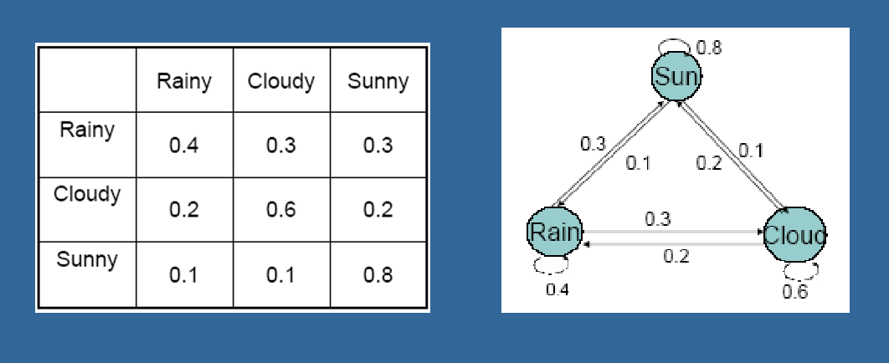
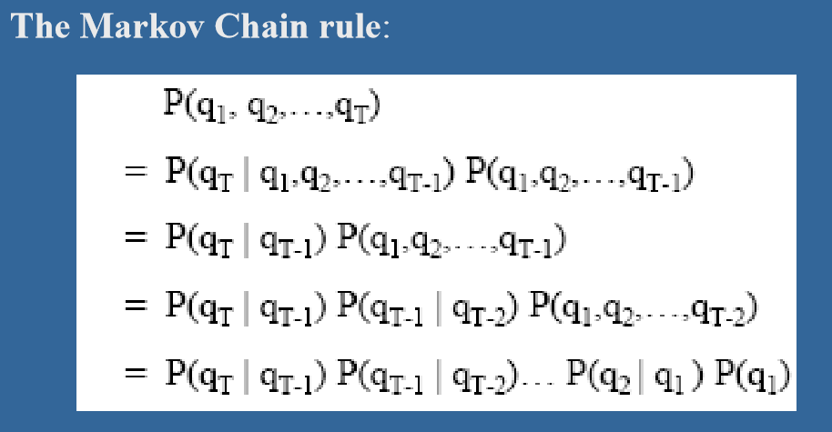
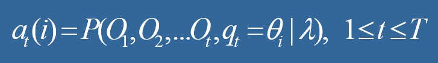
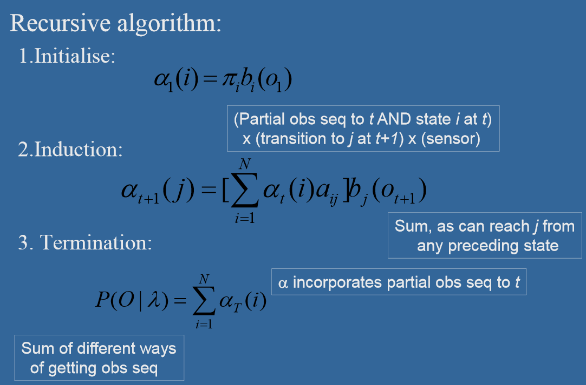
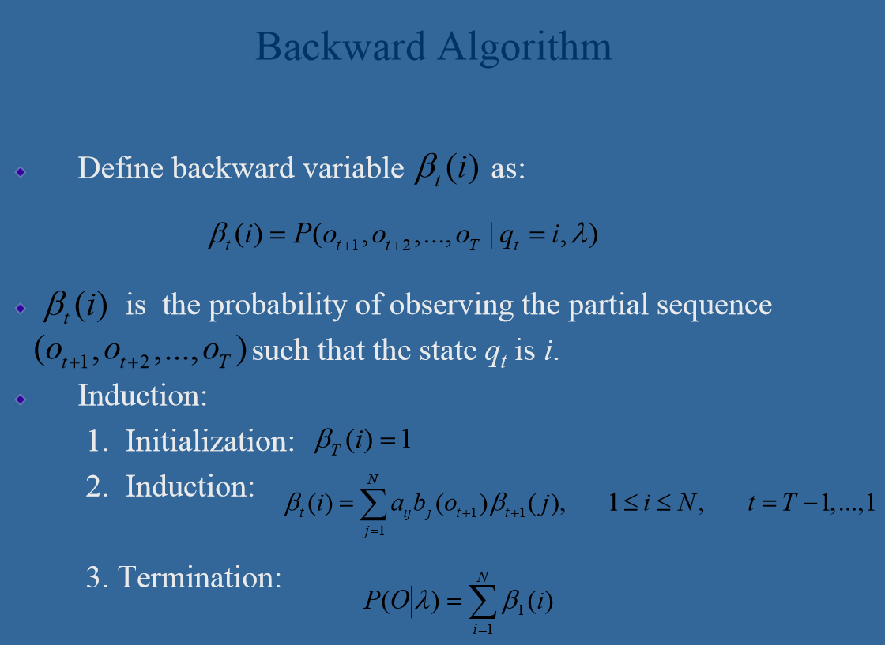

# 隐马尔可夫模型

隐马尔可夫模型\(Hidden Markov Model，HMM\)又称隐马尔可夫链\(Hidden Markov Chain\)，是一种统计机器学习模型。 原本笔者对这类“古老”的机器学习算法兴趣不大，其涉及到很多数学推导，在效果上又往往不如深度学习。之所以介绍这种模型，是因为实验室的学长将HMM应用在推荐系统状态建模上的研究成功入选了nips2018。而最近课程上又对该模型进行了一些系统的解释，因此笔者也对其进行了一番研究。

隐马尔可夫模型基于马尔可夫过程\(Markov process\)，它用来描述一个含有隐含未知参数的马尔可夫过程，主要关键点在于从可观测的序列信息中推断出隐含的参数，以达成某种学习目的。

## 马尔可夫过程

马尔可夫过程指的是一种状态值只与上一时刻状态有关的过程，在每个状态，都会以一个条件概率转移到下一个状态。而状态和时间取值都是离散值的离散马尔可夫过程被称作马尔可夫链。

在此基础上，如果再添加一个条件--状态的转移概率与所处的时间无关，即Xn-1到X-n的转移概率P只与Xn-1有关，与n无关。则该马尔可夫链为齐次马尔可夫链。如无强调后文所涉及讨论中的马尔可夫过程都是齐次马尔可夫链。

对于一个马尔可夫链的状态变化，我们可以将所有状态列出，并将两两间的转移概率表现成一个矩阵的形式。例如一个预测天气的问题中，三种天气的转移概率和转移矩阵如图所示:

左边的矩阵需要满足两点要求：概率值必须大于0。每一行概率之和等于1，这个矩阵记为A

除此之外要定义一个马尔可夫链，我们还需要定义每个状态作为初始状态出现的概率，这个向量记为π={π1, π2, ..., πN}，需要保证π向量的和为1。

根据贝叶斯条件概率公式，用q表示实际过程中出现的观测状态，我们可以得到一个马尔可夫链的求解规则即：

A和π通常都只是基于一些统计数据，但据此我们就已经能做出一些简单的计算和预测了。例如：

* 如果今天天气是sun，接下来7天天气是“sun-sun-rain-rain-sun-cloudy-sun"的概率是多少？
* 连续出现晴天天数的期望值是多少

这些问题仅涉及到概率知识，在此就不赘述。

## 推广到隐马尔可夫模型

隐马尔可夫模型是特殊的马尔可夫链。其中状态值不再能被观测到。观测值是隐状态值的概率函数。

一个典型的例子是缸和球实验：

图中有三种缸，每个缸内的不同颜色彩球分布都不同，在实验中根据π={π1, π2, ..., πN}的初始概率以及转移矩阵A依次选择缸。在选择缸后，再根据对应缸的彩球分布拿出彩球，记下球的颜色。

因此最终得到的序列是彩球颜色的序列O。而缸的选择序列则隐藏起来，只能通过对O分析后进行推测。

HMM通过三个参数进行定义π、A、B 其中π和A的定义与前面相似，只是对应的状态变为了隐状态。B矩阵中的每个元素表示第i个隐状态中出现观测值j的概率。

## 三个基本问题

关于隐马尔可夫链的相关算法都由三个基本问题引出。篇幅所限，本篇只介绍较简单的第一个问题和算法，剩余两个问题和算法留待下次介绍。

### Evaluation问题

问题1：给定一个观测值序列O，一个模型λ=\(π, A, B\)，如何计算序列O出现的概率即P\(O\|λ\)?

解决这个问题的算法被称为前向后向算法\(Forward-Backward Algorithm\)

一种基本的想法是，每当假定一种状态序列q时，我们都能计算出该状态序列q出现的概率P\(q\|λ\)和在q情况下O出现的概率P\(O\|q, λ\)

于是根据贝叶斯公式：P\(O, q\|λ\) = P\(q\|λ\)\*P\(O\|q, λ\)

再遍历所有状态序列组合，求取概率和就可以得到该观测序列出现的概率。问题是，设序列长度为T，状态种类为N，时间复杂度将高达（N^T\)。

前向后向算法都可以用于解决这个时间复杂度问题，它们都是基于动态规划的思想，由于两者方法类似，这里只介绍前向算法。

首先定义前向变量, 给定隐马科夫模型λ，定义到时刻t为止的观测序列为O1,O2,...Ot, 且状态为qi的概率为前向概率：

那么P\(O\|λ\)可以通过下面所示的递归算法得出：

可以看到在每一步中，算法将各种状态到达状态j的概率求和。因此完成迭代后，我们就得到了时间T各种状态出现的概率，将其求和即可。

这和我们之前提到的暴力方法想法一样。但时间复杂度降为了N\(N+1\)\(T-1\)+N次乘法和N\(N-1\)\(T-1\)次加法。总体时间复杂度为O\(T \* N^2\)。

后向算法与前向算法类似，区别在于定义后向变量为，第t个时刻状态为qi的条件下，后续观测序列为ot, ot+1, ..., oT的概率，递归方式和前向算法类似。

在下一篇，我们将介绍其余两种问题和算法，并介绍HMM在实际中的一些应用。

