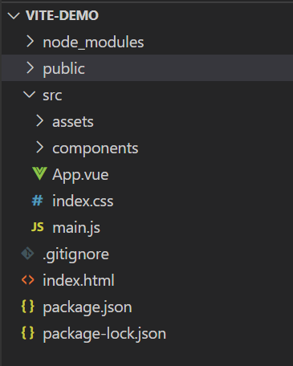
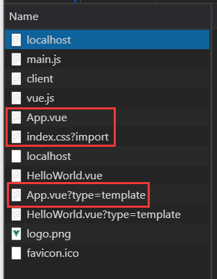

# Vite

Vite

`Vite` 是一个由原生 `ESM` 驱动的 `Web` 开发构建工具。在开发环境下基于浏览器原生 `ES imports` 开发，在生产环境下则基于 `Rollup` 打包。在开发环境下使用浏览器原生的 `ES imports` 开发能够大大提高本地项目构建的效率，引入的模块将由浏览器来做到真正意义上的“按需加载”， `node_module` 不再需要参与本地项目构建。

关于浏览器原生 `ES imports` 如何提升本地项目构建效率，小白已在[snowpack](https://github.com/fff455/tech-share/blob/master/Engineering/snowpack.md)中进行了详细介绍。在原理上Vite与snowpack是相同的。其实并不仅限于构建原理，两者在特点、优缺点上也不尽相同。`Vite` 之前独有的ts编译、HMR等功能，`snowpack`也在v2发布后均有了支持。

两者的区别，或许就在于 `Vite` 是尤大出品，能与 `Vue3` 的生态更好的结合，属于与`VueX`、`vue-cli` 类似的 `Vue` 全家桶之一。

相比之下 `snowpack` 的优势在于更加的成熟，也已经发布了正式版的v2。支持的框架也更为全面，包括 `React` 与 `Vue`。

## Vite 项目简析

鉴于一些特性的介绍已经在 `snowpack` 中有了介绍，所以本文更偏向于对 `Vite` 项目的代码进行学习。

* 构建 `Vite` 项目，指令已涵盖在 `Vue3`，所以有 `Vue3` 环境可以直接执行

  ```text
  $ npm init vite-app <project-name>
  $ cd <project-name>
  $ npm install
  $ npm run dev
  ```

* 构建完成后，可以看到十分简洁的项目结构

  

  根目录下除去必备的 `node` 相关文件和静态资源文件`public`，就是主入口的 `index.html` 与 `Vue` 源码。其实这也有些过于简单了，对于 `Vue` 项目几乎必备的 `router` 和 `VueX` 其实也可以默认加上。

* 那么来看 `index.html` 与 `main.js` 两个文件

  ```javascript
  // main.js
  import { createApp } from 'vue'
  import App from './App.vue'
  import './index.css'

  createApp(App).mount('#app')
  ```

  `main.js` 中并没有什么特殊之处，使用了 `Vue3` 构建 `Vue` 实例的语法 `createApp`，特殊之处主要在于`index.html`增加了一行内联 script

  ```markup
  <script type="module" src="/src/main.js"></script>
  ```

  浏览器会识别添加 `type="module"` 的 `<script>` 元素，浏览器会把这段内联 script 或者外链 script 认为是 `ECMAScript` 模块，浏览器将对其内部的 import 引用发起 http 请求获取模块内容，通过对入口的引用方式改变，进而使整个项目都通过 `ESM` 来实现按需加载。

* 继续看 `main.js` 经过 `vite` 转换后的代码

  ```javascript
  import { createApp } from '/@modules/vue.js'
  import App from '/src/App.vue'
  import '/src/index.css?import'

  createApp(App).mount('#app')
  ```

  由于 `vite` 只能识别"/", "./", or "../"开头的 import 路径，所以会对引入的库增加一个`/@modules`的一个前缀。这与 `snowpack` 中的 `/web_modules` 相对应。不添加这一相对路径，浏览器就无法对引入的模块进行识别。这不同于我们平时使用 `Webpack` 找模块进行引入，后者会直接去开发环境本地的 `node_modules` 中进行寻找，但浏览器并不在意 `node_modules`，因而只能通过相对路径去找对应模块。

  在这一点上，我们可以得出一个结论：**在浏览器通过http请求模块的过程中，`vite` 会对请求进行拦截，并返回增加相对路径前缀后的结果**。

* 基于上面得出的这一结论，我们也可以知道在`main.js`中使用了 `createApp` 方法，而不是像在`vue-cli`中那样直接引入 `Vue` 的原因

  ```javascript
  // 转换前
  import Vue from 'vue'

  // 转换后
  import Vue from '/@modules/vue.js'
  ```

  直接进行引入并通过 `Vite` 转换后，可以发现浏览器直接报错

  

  所以如果后续有对 `vue-router` 或 `VueX` 引入的需要，需要找到 `Vue3` 中创建 router 与 store 对应的方法。

* 最后再来看下 `Vite` 中对单个 `Vue` 文件的请求

  

  很明显对单个 `Vue` 文件来说，都会被请求三次，先后分别为script、style、template，如图中的`App.vue`。而 `vue-cli` 中，我们会发现浏览器请求到的将是一个合并好后的 `App.js`。实际上就是 `Vite` 在拦截请求时，不仅对路径进行了处理，也实现了实时的按需编译。

## 在Vite中使用Vue-Router与VueX\(补充\)

使用`Vite`进行项目构建时，没有像`vue-cli`那样提供那么多的配置项，其中就包括`Vue-Router`与`VueX`，需要在项目构建完成后进行额外引入，随着`Vue3`文档与代码的逐渐完善，`Vue-router4。0`与`VueX4.0`的发布，引入router与store所需的Api也已经有了提供。

```javascript
// store/index.js
import { createStore } from 'vuex'

export default createStore({
  state: {
  },
  mutations: {
  },
  actions: {
  },
  modules: {
  }
})
```

```javascript
// router/index.js
import { createRouter, createWebHashHistory } from 'vue-router'
// 若使用ts，则需要引入RouteRecordRaw作为routes的类型
import HelloWorld from '../components/HelloWorld.vue'

const routes = [
  {
    path: '/',
    name: 'Home',
    component: Home
  }
]

const router = createRouter({
  history: createWebHashHistory(),
  routes
})

export default router
```

```javascript
// main.js
// 入口文件挂载store与router
import { createApp } from 'vue'
import App from './App.vue'
import router from './router'
import store from './store'
import './index.css'

createApp(App).use(store).use(router).mount('#app')
```

## 结语

作为 `Vue` 全家桶新成员之一， `Vite` 无疑是未来可期的。在`Vue3`的官方文档中，`Vite`已经是一个与`@vue/cli`同级别的项目构建工具。

但在目前的生态下， `Vite` 想要逐渐替换 `Webpack` ，不仅需要其本身逐渐走向成熟，也需要社区生态更多的支持。

