# 3D 数学基础

## 矢量

### 点积

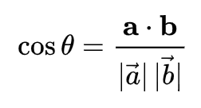
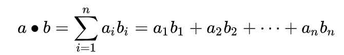

### 叉积

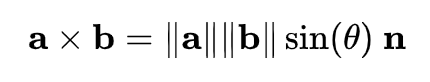
将右手食指指向 a 的方向、中指指向 b 的方向，则此时拇指的方向即为 a x b 的方向

## 矩阵

### 线性变换

#### 旋转

在二维中，只会针对某一点进行旋转。在三维中，会针对某一个轴进行旋转。旋转仅具有一个参数：旋转角度 θ ，它定义了旋转量。
在二维或者三维空间中对某一个点做旋转，可以分解为各个方向基矢量的旋转。

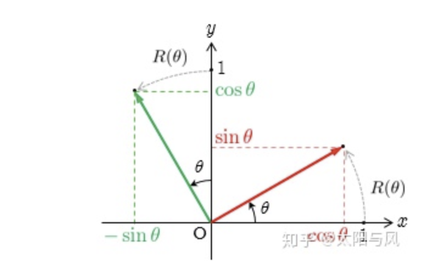
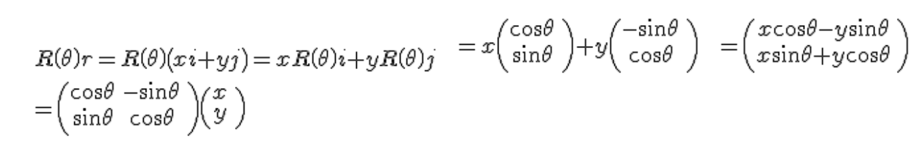
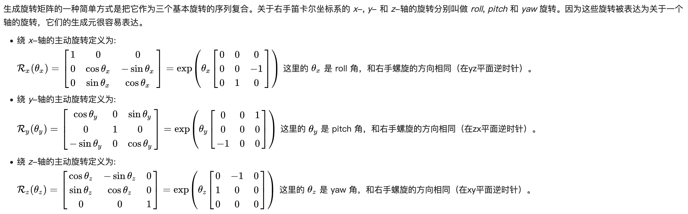

[任意轴三维旋转](https://zhuanlan.zhihu.com/p/56587491)

#### 缩放

任意方向的缩放
设 n 为平行于缩放方向的单位向量，k 为缩放因子，缩放沿着穿过原点的并平行于 n 的直线（2D 中）或平面（3D 中）进行。
先讨论 2D 中的推导过程。我们需要推导一个表达式，给定向量 v，可以通过 v,n 和 k 来计算 v`。将v和v`分解为平行和垂直于 n 的分向量
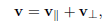
v||是 v 在 n 上的投影
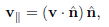
v⊥ 垂直于 n，不会受缩放影响

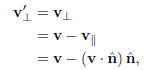
v\`||受缩放因子影响  推导得到 v\`

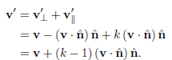
通过表达式来推导基向量

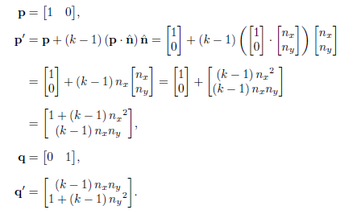
通过基向量构建矩阵，得到以单位向量 n 为缩放方向，以 k 为缩放因子的缩放矩阵
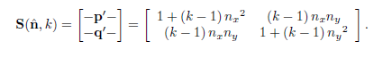
同样的原理运用在 3D 中
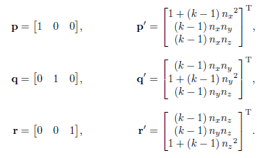
是 scale(缩放)的缩写 S(n,k)表示缩放矩阵
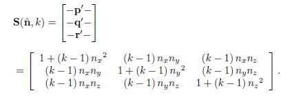

#### 投影

投影到任意线和平面

#### 反射

围绕任意轴反射的二维矩阵
围绕任意平面反射的二维矩阵

#### 错切

错切是一种倾斜坐标空间的变换，它将不均匀地拉伸坐标空间，不保留角度，但是保留体积和面积。一个基本的思路是将一个坐标的倍数添加到另一个坐标上。

### 变换的类型

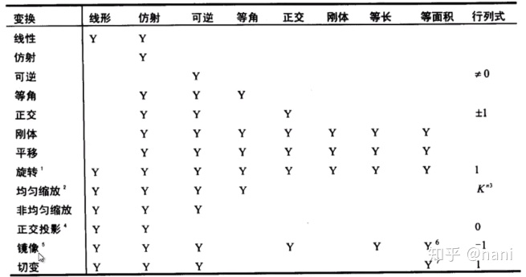

### 行列式

对于方形矩阵，存在一个特殊的标量：行列式。

#### 矩阵的行列式

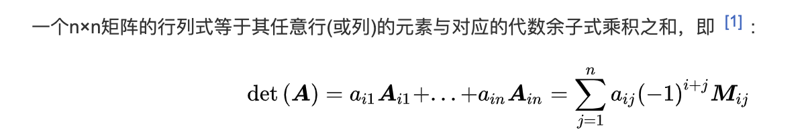

#### 行列式一些比较重要的特征

- 任何维度的单位矩阵行列式为 1
- 矩阵乘积的行列式等于行列式的乘积
- 矩阵转置的行列式等于原始矩阵的行列式
- 如果矩阵的一行或者一列都为 0，那么行列式为 0
- 交换任意行或者任意列会让行列式变负
- 将行（列）的任意倍数添加到另一行（列）上，行列式不变

#### 行列式的几何解释

二维中，行列式等于两个矢量作为两条边的平行四边形面积
三维中，行列式是平行六面体的体积。
如果行列式为 0，则矩阵包含投影，如果行列式为负，则矩阵包含反射。

### 逆矩阵

一般情况下，奇异矩阵的行列式为 0，非奇异矩阵的行列式不为 0。特殊情况：具有基矢量的极端错切矩阵，构成具有单位体积的非常长的薄平行六面体，行列式为 0，矩阵几乎是奇异的。

#### 伴随矩阵

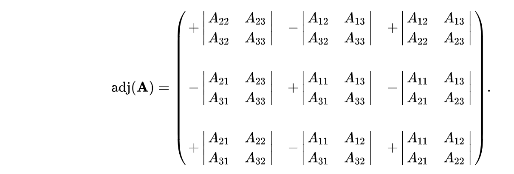

#### 计算逆矩阵--正式线性代数规则

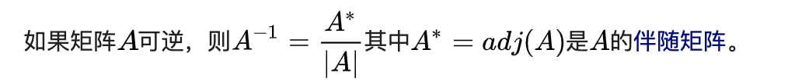

#### 矩阵求逆的重要特征

- 矩阵的逆矩阵的逆是原始矩阵
- 矩阵转置的逆矩阵是矩阵逆的转置
- 逆矩阵的行列式是原始矩阵行列式的倒数

#### 逆矩阵的几何解释

撤销一个变换

### 正交矩阵

#### 正交矩阵--正式线性代数规则

- 当且仅当矩阵及其转置的乘积是单位矩阵时，方阵 M 是正交的。
- 如果矩阵是正交的，那么矩阵的转置等于矩阵的逆

#### 正交矩阵的几何解释

- 如果变换矩阵仅包含旋转和/或反射，那么得到的变换矩阵是正交矩阵
  要使矩阵正交，需要满足：
- 矩阵的每一行是单位矢量
- 矩阵的行必须相互垂直

#### 矩阵的正交化

- 三维基矢量的 Gram-Schmidt 正交化
- 无偏差的递增正交化

### 齐次矩阵

#### 齐次空间

考虑二维中的齐次坐标 (x, y, w)，可以通过 (x/w, y/w) 将三维的一个点映射到 w=1 的平面之上。
三维中的情况也相同，三维空间的点可以认为是存在于四维 w=1 的超平面上。
使用齐次坐标主要有两方面的考虑：

1. 表示上的方便，可以将线性变换与平移变换，先旋转再平移。需要着重理解的是平移变换实际上是更高维度的线性变换，即在四维空间中应用错切变换，在三维空间中的效果是被平移了。
2. w 取适当的值，齐次除法将导致透视投影。

#### 一般性的仿射变换

由于使用了 4x4 的齐次矩阵，增加了三维上的平移操作，因此之前的变换可以更加一般化。
之前的多数要求都是要基于原点进行，例如旋转和缩放等。引入了齐次矩阵后我们可以不必基于原点。使用平移先进行变换到原点上，然后应用线性变换，再平移回去。
透视投影矩阵
投影到在 z=d 的平面的投影矩阵：
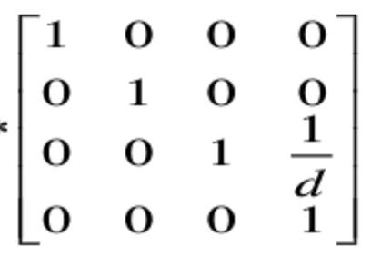

## 极坐标

### 二维

二维中的极坐标使用 (r, ⍬)进行表示，角度[-π, π]使用弧度而非度数进行表示。

### 三维

三维空间的极坐标使用三个参数描述，第三个的参数既可以是一个距离，也可以是一个角度。
当第三个参数是距离时，使用的是圆柱坐标；第三个参数是角度时，使用的是球面坐标。
使用球面坐标会使第三个参数为 0 时陷入万向节死锁。

## 三维旋转

### 定向

对于一个矢量而言，如果沿着矢量的方向对矢量进行旋转，那么矢量是不会变化的。但是考虑一个具有具体形态的物体例如飞机，沿着飞行方向对飞机进行旋转，飞机会发生变化。
使用球面坐标来描述，方向可以使用两个数来表示，即球面坐标的两个角度。但是定向需要三个数字（欧拉角）。
