# WebGL 中绘制直线

绘制直线常用的方案

- 直接使用原生 gl.LINES 的问题
- 使用沿法向拉伸后三角化的方法绘制直线
- 接头样式、反走样等常见优化手段
- Cesium、Mapbox、GeoJS 等成熟引擎的实现

## gl.LINES 存在的问题

在一些场景下，尤其是涉及到地理信息的展示，直接使用原生的 gl.LINES 进行绘制存在一些问题：

1. 线宽无法设置
   Chrome 下试图设置 lineWidth 会得到警告，相关 ISSUE ：
   `MDN ：As of January 2017 most implementations of WebGL only support a minimum of 1 and a maximum of 1 as the technology they are based on has these same limits.`
2. 无法定义相邻线段间的连接形状 lineJoin 以及端点形状 lineCap

因此我们得考虑将线段转换成其他几何图形进行绘制。

## 沿法向拉伸

常用的做法是沿线段法线方向进行拉伸后三角化。例如下图中线段两个端点分别沿红色虚线法向向两侧拉伸，形成 4 个顶点，三角化成 2 个三角形。
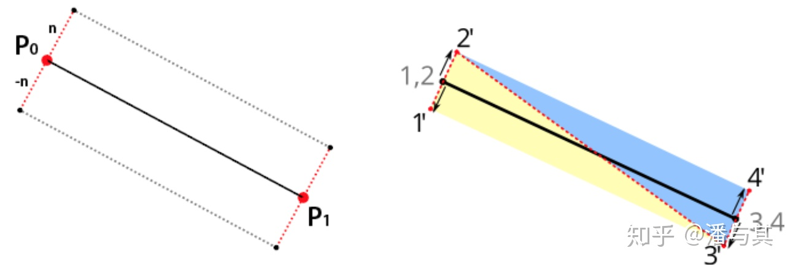
沿原始线段法向拉伸进行三角化
这样实现起来很容易，例如 deck.gl 的 LineLayer ：
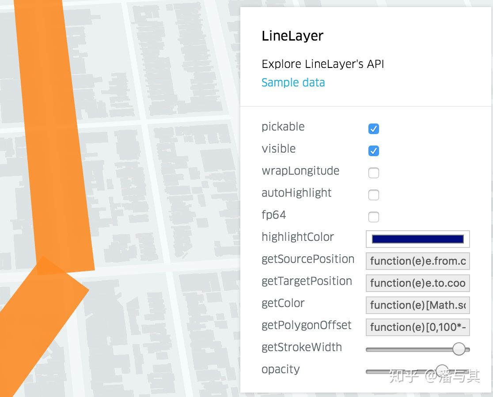
deck.gl - LineLayer
但是很明显，我们需要在相邻线段的连接处进行处理。

## 连接接头

在 Canvas API 中可以通过 lineJoin 指定线段接头处的连结方式，同样 SVG 中也有 stroke-linejoin 属性。从上到下分别为 rounded、bevel 和 miter。

lineJoin： rounded、bevel 和 miter
我们以 miter joint 斜接接头为例 ，看看在 WebGL 中如何实现。以下思路来自「Smooth thick lines using geometry shader」 。

首先需要计算切线方向 t，然后计算斜接接头方向 m 为 t 的法线方向，最后得到线宽（红色虚线）投影到接头方向的长度：
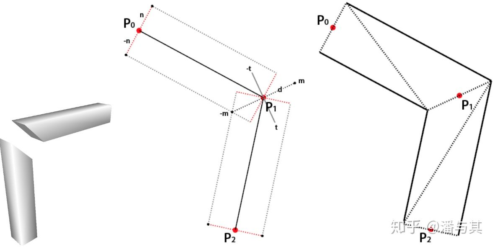

```js
// https://github.com/mattdesl/polyline-miter-util/blob/master/index.js#L9-L20
function computeMiter(tangent, miter, lineA, lineB, halfThick) {
  // 计算切线
  add(tangent, lineA, lineB);
  normalize(tangent, tangent);

  // 计算接头方向
  set(miter, -tangent[1], tangent[0]);
  set(tmp, -lineA[1], lineA[0]);

  // 半线宽投影到接头方向的长度
  return halfThick / dot(miter, tmp);
}
```

在 vs 中，根据 miter 计算点的偏移量：

```glsl
// https://github.com/mattdesl/three-line-2d/blob/master/shaders/basic.js
uniform float thickness; // 线宽
attribute float lineMiter; // miter 长度
attribute vec2 lineNormal; // normalize 之后的法线方向

vec3 pointPos = position.xyz + vec3(lineNormal _ thickness / 2.0 _ lineMiter, 0.0);
```

斜接接头还存在一个很明显的问题，如果连结处的夹角很小，就会导致计算出的 miter 无限大，视觉效果很不好。例如下图：
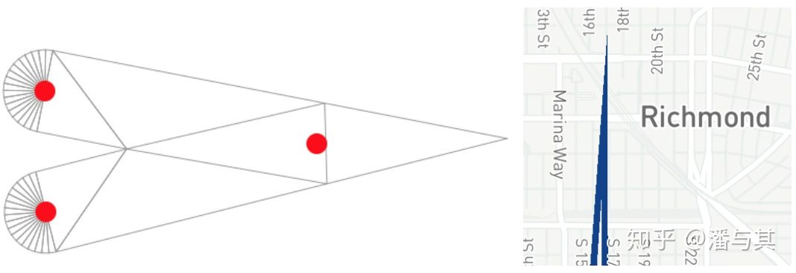
相邻线段夹角很小导致 miter 长度过长
因此我们可以设置一个 miter 阈值，超过之后就使用 bevel 接头，对应 SVG 中的 stroke-miterlimit 属性。

相比 miter，在三角化时需要增加一个三角形，对于接头处的每一个顶点，内侧仍然使用 miter 的一个，而外侧需要生成两个：
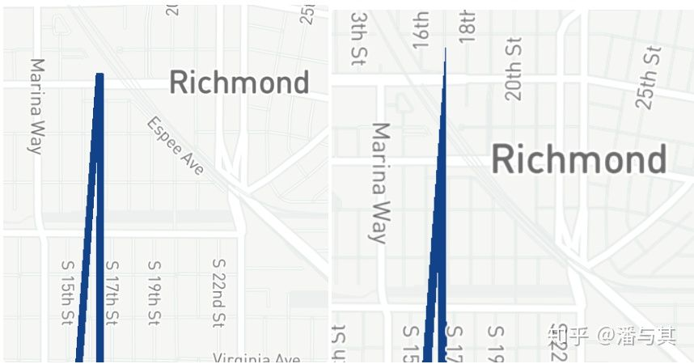
bevel 接头
除了 miter 和 bevel 接头，还可以使用圆角，例如 deck.gl 的 PathLayer 开启 rounded 选项之后：
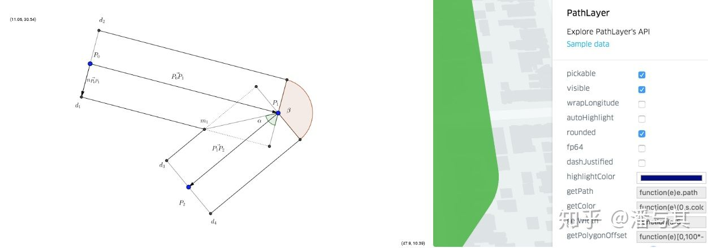
圆角接头
对于圆角接头，Mapbox 的做法是在 CPU 预处理时添加大量额外顶点 。

而 GeoJS 完全在 shader 中实现，代价就是传入 GPU 的顶点数据量增大（当前顶点、前后两个顶点）。

## 反走样

如果仔细观察我们目前绘制的线段，可以发现边缘处明显的走样现象：

早期 mapbox 采用过一种办法：绘制出多边形后，在边缘使用 gl.LINES 再进行描边（线宽为 2），利用平台对于直线的 MSAA。但是由于不允许设置非 1 的线宽，不得不移除了这种方法。相关 ISSUE & PR 。

如果不依靠基于后处理的几何反走样方式 FXAA/MLAA ，我们有以下几种方式可以尝试。

## 增加顶点

最直接的办法是增加三角化的三角形数目，例如「Mapbox - Drawing Antialiased Lines with OpenGL」 中就介绍了这种方法，在两侧各增加一对三角形用于渐变：
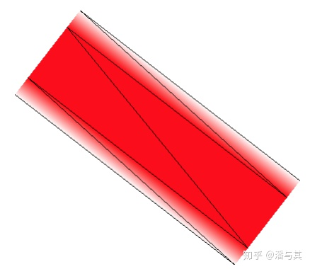
但是这对于渲染性能显然是有较大影响的（顶点数 x2，三角形 x3）。

## 对单位法向量插值

如果能在 fs 中获取到当前 fragment 到原始线段的距离，就可以对边缘进行模糊。

很自然想到之前利用重心坐标实现 wireframe 。但是这种方法有一个明显的缺陷，在 mapbox 的一个 ISSUE「Antialias fills without gl.LINES」 中有清晰的展示，即不同于 wireframe，我们只想处理三角形的某一条边而非三边，并且即使我们找到了这条边，也还会缺少一块：
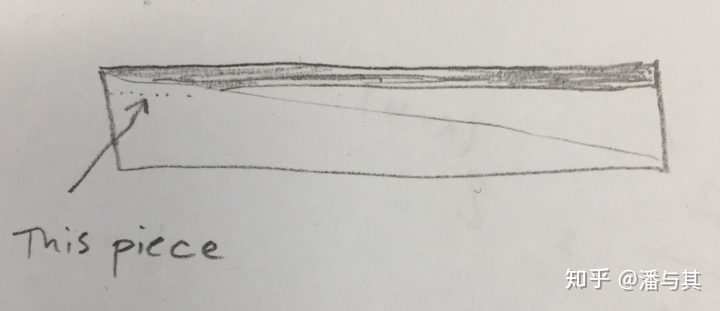
还记得在 vs 中我们计算出的 normalize 之后的法线方向吗？利用 varying 插值，在 fs 中获取到单位法向量的插值结果，显然插值后就不是单位向量了（如下图），但我们可以利用向量长度作为模糊因子。
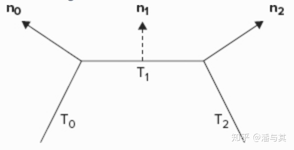
对单位法向量进行插值

```glsl
varying vec2 v_normal;

float blur = 1. - smoothstep(0.98, 1., length(v_normal));
gl_FragColor = v_color;
gl_FragColor.a \*= blur;
```

效果如下，可见边缘的走样现象缓解了很多：
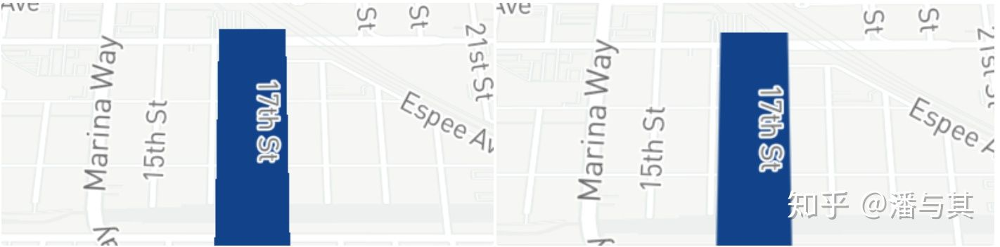
反走样效果前后对比

## Prefiltered

除此之外，还有基于查找表的预过滤方式。基本思路是首先计算出拉伸后的两个 edge function，离线将卷积（box、Gaussian）结果存储在纹理中，在运行时将当前 fragment 位置带入 edge function 得到距离原始线段的长度，再查表得到卷积结果：

「GPU Gems2 - Fast Prefiltered Lines」

「Fast Antialiasing Using Prefiltered Lines on Graphics Hardware」

「Prefiltered Antialiased Lines Using Half-Plane Distance Functions」

解决了走样问题，我们再来看几个常见问题。

## 在 GPU 中进行墨卡托投影

如果投影变换是在 GPU 而非 CPU 中进行的，例如 deck.gl ，在使用原始经纬度坐标计算出法线方向后，还需要在 shader 中进行转换，例如：

```glsl
// u_pixels_per_meter 表示在当前经纬度点，一度对应多少像素
vec3 offset = normalize(vec3(lineNormal, 0.0) \* u_pixels_per_degree)
```

- thickness / 2.0 \* lineMiter, 0.0;
  由于和缩放等级相关，在每次相机发生改变时，在 CPU 中需要重新计算并传入 u_pixels_per_degree：

```js
const worldSize = TILE*SIZE * scale; // 当前缩放等级下的像素尺寸
const latCosine = Math.cos(latitude \_ DEGREES_TO_RADIANS);
const pixelsPerDegreeX = worldSize / 360;
const pixelsPerDegreeY = pixelsPerDegreeX / latCosine;
```

## 固定线宽

2D 的线在正交投影下可以保证一致的宽度，但是在透视投影下就无法保证了。在某些需要时刻保持线宽一致的 3D 场景下，例如 Cesium 在地形图中展示滑雪路线 ：
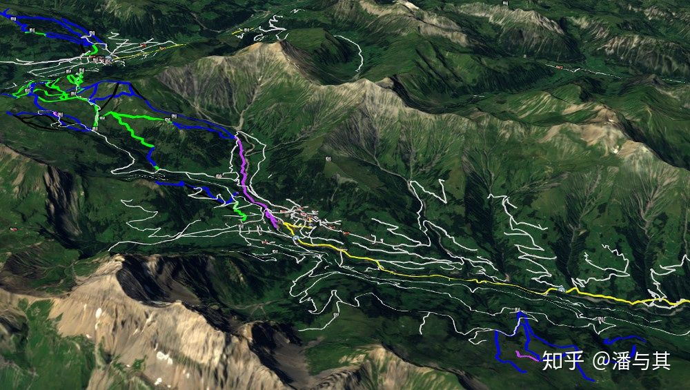
常见的做法是投影到屏幕空间，这就需要将之前在 CPU 中对于法线和 miter 的计算挪到 vs 中进行。

通过除以 w 分量转换到 NDC 坐标系，再乘以宽高比就得到了屏幕空间坐标：

```glsl
vec2 project_to_screenspace(vec4 position, float aspect) {
return position.xy / position.w \* aspect;
}
```

由于 WebGL 不支持 Geometry Shader，因此除了当前顶点位置，还需要将前后顶点的位置一并传入顶点数据：

```glsl
attribute vec3 position;
attribute float direction;
attribute vec3 next;
attribute vec3 previous;

// currentPos、prevPos、nextPos 已经通过 mvp 矩阵投影到裁剪空间

// 投影到屏幕空间
vec2 currentP = project_to_screenspace(currentPos, aspect);
vec2 prevP = project_to_screenspace(prevPos, aspect);
vec2 nextP = project_to_screenspace(nextPos, aspect);

// 计算切线和 miter
vec2 dir1 = normalize(currentP - prevP);
vec2 dir2 = normalize(nextP - currentP);
vec2 tangent = normalize(dir1 + dir2);
vec2 perp = vec2(-dir1.y, dir1.x);
vec2 miter = vec2(-tangent.y, tangent.x);

// 投影到 miter 方向
len = thickness / dot(miter, perp);
vec2 normal = vec2(-dir.y, dir.x);
normal \*= len/2.0;
normal.x /= aspect;

// 得到最终偏移量
vec4 offset = vec4(normal \* orientation, 0.0, 1.0);
```

基于 Three.js 的实现：https://github.com/spite/THREE.MeshLine 也采用了类似的做法。Codrop 上有一篇使用它实现各种动画效果的教程 ，感兴趣的也可以阅读下。

## 虚线

「Shader-Based Antialiased, Dashed, Stroked Polylines」 中使用的方法较为复杂。

这里我们采用一种较为简单的实现，同样还是利用 varying 插值，在 CPU 中对顶点数据进行预处理，对于每个顶点计算总顶点数的占比。但是缺点也很明显，虚线并不是按长度等分的。如果想做到按长度等分，就需要计算每段长度和总长度的占比，相应的会加重预处理顶点数据的负担：

```glsl
varying float v_counters; // 占总顶点数比例

uniform float u_dash_offset; // 控制起始点，SVG stroke 动画中常见
uniform float u_dash_array; // 控制虚线疏密
uniform float u_dash_ratio; // 控制每小段可见比例

gl_FragColor.a \*= ceil(mod(v_counters + u_dash_offset, u_dash_array)
- (u_dash_array \* u_dash_ratio));
```

效果如下：

虚线效果

## 总结

绘制直线并不是一件简单的事，尤其是考虑到绘制效果和性能。我们以上的讨论也只是集中在 lineJoin 连结方式上，线的很多其他属性例如端点处的样式 lineCap 并没有涉及。另外除了直线，还可以使用弧线连接两点，例如 deck.gl 的 ArcLayer 。

值得一提的是 GeoJS 对于直线的各种属性支持做的很好，除了 lineJoin（miter | bevel | round）、lineCap（butt | square | round），包括 miter 的阈值、反走样（模糊半径）都可以进行配置。而且从内部实现来看，完全在 shader 中进行，不依赖 CPU 对于顶点数据的预处理，还是很值得进一步研究的。
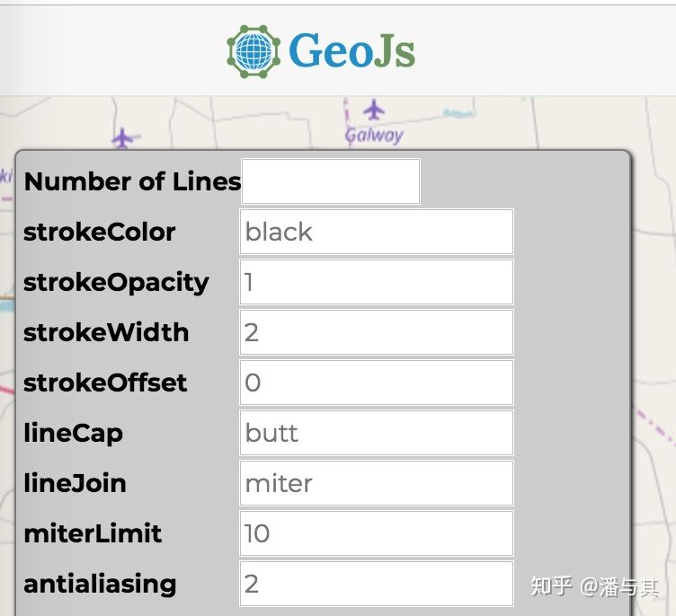
GeoJS 中对于直线的配置项
