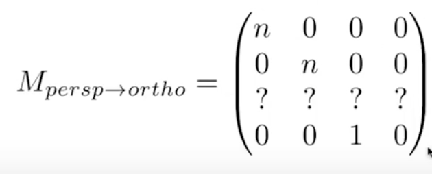
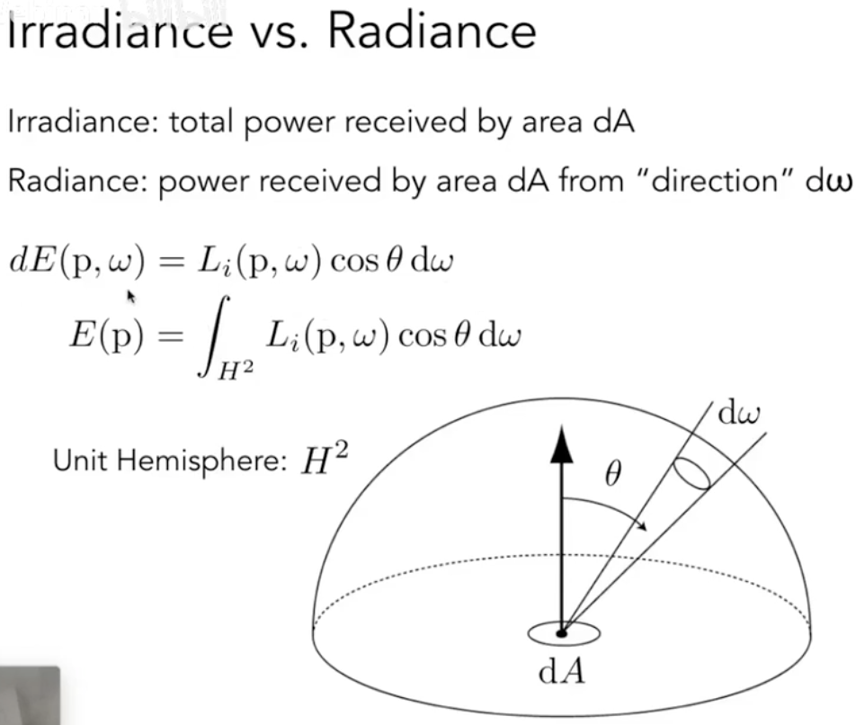

# 现代计算机图形学基础

## **L1 Overview of Computer Graphics**

如何判断游戏画面质量好不好，看画面是否足够亮就可以。其中涉及到的技术知识是全局光照，如果全局光照做得好，画面就会亮。

### **图形学的挑战**

与虚拟世界真实的互动效果

对真实世界的理解

新的计算/展示方法

### **技术上的挑战**

投影/曲线/表面等数学知识

光照/阴影的物理知识

3D 形体的展示与变换

动画与仿真

**光栅化**：把 3D 的物体显示在平面上，实时（30fps）计算机图形学的主要应用

光线追踪-慢，新的技术：**实时光线追踪**

### **图形学 VS 计算机视觉**

视觉：一切需要猜测的内容。比如，根据图片识别出人和物体/深度学习。

## **L2 线性代数入门**

### **叉乘**

可以用来判断点在向量的左边还是右边，拓展，通过这一应用可以来判断点是否在三角形内部：与边的三个向量叉乘都为正或者都为负

### **矩阵**

点乘和叉乘都可以写成矩阵的乘法形式

a，b 点乘 等于 a 的转置乘 b

a，b 叉乘 等于 a 的对偶矩阵（dual matrix）乘 b

## **L3/L4 Transformation**

### **Why Study**

Modeling 模型变换

Viewing 视图变换

### **齐次坐标**

二维中，点的坐标可以扩展为\(x, y, 1\)，向量的坐标可以扩展为\(x, y, 0\)。向量之所以是 0，是因为向量具有平移不变性。

### **仿射变换**

仿射变换=平移+线性变换

用于仿射变换的齐次矩阵是先线性变换，再平移。

### **投影**

正交投影/平行投影，不会造成近大远小的现象

透视投影，更加贴近人眼的成像

### **平行投影**

将一个立方体通过仿射变换，变为：左右在 x 轴，上下在 y 轴，远近在 z 轴。先平移，再缩放。

### **透视投影**

平行线不再平行。

\(x,y,z,1\) = \(xz,yz,zz,z\)\(z!=0\)

透视投影的视角是一个四棱锥，平行投影的视角是一个长方体。直接写出透视投影的转化矩阵会比较困难，可以考虑将四棱锥投影的棱台压缩成一个一个长方体，然后再进行平行投影。

## **L5/L6 Rasterization 光栅化**

### **屏幕**

典型的光栅成像设备

是像素的一个数组

数组的大小就是分辨率

**光栅化**：把三角形画到屏幕（像素）上的过程

**Pixel**：picture element

### **屏幕空间**

屏幕的坐标系，左下为原点。所有的像素可以用一个坐标来表示，像素中心在方块的中心。

需要将\[-1, 1\]空间映射到\[width, height\]的屏幕空间。

**视口变换：**

### **光栅显示设备**

阴极射线管 CRT

电子经过偏转，会打在不同的位置上。

隔行扫描：在一个时刻，将图像每隔一行进行绘制。奇数行绘制当前图像，偶数行绘制下一帧，利用视觉停留可以使图像看起来是连续的。可用于视频压缩，会造成画面撕裂，尤其在高速运动的画面中。

**现代显示器 Frame Buffer**

使用内存的一块区域（显存）来存储图像信息。

LCD 液晶显示器

液晶的排布可以影响光的极化（光的偏振方向），光通过液晶时可以改变光的方向。

LED 发光二极管

电子墨水屏

刷新率很低，看起来很自然。

### **三角形的特殊性质**

三角形是最基础的多边形，任何多边形可以拆分为三角形

三角形做插值方便

三角形的边界定义很明确

三角形一定在一个平面上

### **光栅化的重要步骤**

#### **像素中心点与三角形的位置关系**

采样

函数离散化

判断点是否在三角形内

顺序叉积的符号相同

边界处理

不处理或者特殊处理

缩小屏幕点遍历区域

包围盒

#### **锯齿/走样**

锯齿产生原因：采样。

采样可在空间中进行，也可在时间中进行。

**采样**

采样会产生一系列问题：锯齿，摩尔纹，车轮效应。

本质原因：信号变化太快，采样速度跟不上信号变化速度。

**抗锯齿/反走样**

先模糊，再采样

**频域**

傅立叶变换可以将一个函数以 sin 和 cos 的线性组合来表示。

可见傅立叶级数的各项频率不同，可以理解为一个函数在各个频率上都有其分解的值，傅立叶变换就是把函数变为不同频率的段。

同一采样速率，频率越高，采样的准确性越低。

走样在频率上的解释：下图频率完全不同的函数使用同一个采样函数获取到了相同的结果。

使用傅立叶变换可以将图片从视域变换为频域。

滤波：将特定频率的信号去掉。

视域上的卷积等于频域上的乘积

采样：重复频域上的内容

**抗锯齿方案**

MSAA Antialiasing By SuperSampling

细化像素点，用更多的点来采样一个像素点，取点的平均值（模糊操作）作为像素的值。近似覆盖率，没有提高分辨率。

FXAA Fast Approximate AA

后期处理，先得到锯齿图形，找到图形的锯齿边界，再把边界换成没有锯齿的边界。

TAA Temporal AA

找上一帧的边界，复用上一帧的像素值。相当于 MSAA 在时间上的分布。

**超分辨率 Super resolution**

把小分辨率图拉大为大分辨率，但是不想产生锯齿。

DLSS：深度学习，根据采样猜测每个分辨率点的像素

**可见行（遮挡关系）**

**画家算法**

按照远近顺序来画：先画远处的三角形，再画近处覆盖远处三角形。排序 O\(n logn\)，但是有一种情况无法使用画家算法：

**深度缓存**

在光栅化的时候，生成另一张图，图只存深度相关的信息。遍历每个三角形的每个像素，当深度小于存的值时，更新深度信息，存储更小值。

认为每个三角形都不会特别大，那么一个三角形会覆盖常数个像素。复杂度为 O\(n\)。

## **L7/L8/L9 Shading 着色**

当三角形画出来后，它的颜色并不是初始的颜色，人眼更愿意接受有光影效果的，明暗不一的效果。

### **局部光照**

只看光照点，不关心阴影等。

三个方向：光照方向，法线方向，观测方向。

**Blinn-Phong 反射模型**

**高光 Specular Highlights**

什么时候能看到高光：观测方向与光照镜面反射方向接近时---平面法向方向与半程向量接近。

半程向量：向量 v 与向量 l 的角平分线单位向量，如果 v 和 l 是单位向量，基于菱形性质，那么半程向量为

如何衡量两个方向是否接近：点乘结果。

为什么有幂 p：一次函数容忍度太高，实际高光的范围不会太大。

**漫反射 Diffuse refection**

光照照在平面，产生各个方向的反射。与观测方向无关。

漫反射与光照方向与平面法线的夹角有关（平面接受光照的能量）。

Lambert 理论，平面接受的光照的能量和光照方向与平面法线的夹角的余弦成正比。

平面接收的能量与点光源的距离的平方成反比。

### **间接光照，环境光 Ambient lighting**

假设各个地方的环境光都相同，是一个常数。

**Shading Frequencies 光照频率**

把光照点应用在一个平面 flat shading

应用在顶点，插值计算 gouraud shading

应用在每个像素，phong shading

如果模型足够复杂，即三角形足够多，那么 flat shading 依然会有很好的表现，而且计算量更小。

逐顶点的法线：对点相邻的平面的法线做面积加权平均。

**图形管线（实时渲染）**

Shader: 顶点和像素如何着色，现代 gpu 中可编程。

顶点：Vertex Shader

像素：Fragment Shader

Compute Shader：做任何形式的计算，不局限与图形学内部，general purpose gpu =&gt; GPGPU

**纹理映射**

定义任何一个点的基本属性（如漫反射系数）。

任何一个三维物体的表面都是二维的，纹理就是一张图，把纹理蒙在一个三维物体上，就是纹理映射。

纹理坐标系，uv，u 和 v 在\[0, 1\]。

纹理无缝衔接：tiled（Wang Tiled）。

先对三角形顶点应用得到纹理的 uv，利用插值获取三角形内部的像素的纹理坐标。

### **如何在三角形内部做任意属性的插值**

为什么做插值：很多操作基于三角形顶点，希望在三角形内部得到平滑的表现。

插值可以应用于纹理坐标/颜色/三角形法线等。

**重心坐标**

重心坐标可以通过面积比值求出

重心投影之后可能会改变，三维空间中的属性要在三维空间中计算，再映射到投影平面中，不能先投影再插值。

### **纹理放大**

纹理的一个像素：texel，当纹理的分辨率小于屏幕的分辨率时，多个 pixel 会映射到同一个 texel，会拉大纹理显示。

**双线性插值 Bilinear**

**双向三次插值 Bicubic**

取周围临近的 16 个点，再做双向插值。每次用 4 个做三次插值，非线性插值。

**纹理过大**

纹理过大时，进行映射，会出现走样问题。产生原因：屏幕一个像素覆盖一个像素，但是对应纹理上覆盖了一片区域。如果直接使用纹理上的值，相当于只用一个点标示了一片区域

使用超采样可以优化图形显示，但是开销非常大。

点查询：给出一个点，查询像素多少。

范围查询：给出一个区域，需要查询这个区域的平均值。

**Mipmap**

允许做范围查询，快/近似/只能做方形查询。预先生成一系列图。只多了 1/3 的存储空间。

把相邻两个像素映射到纹理空间中，求出纹理空间两个点的距离可以作为正方形的边长。

中间层插值：三线形插值，先对相邻两层对点做双线性插值，再对层与层中间的值进行插值。

三线形差值带来了过分模糊的现象，远处的细节丢失。

**各项异性过滤 Anisotropic Filtering**

可以查询矩形区域，不限制为正方形，Mipmap 相当于取了对角线。

不规则查询：多次查询，使用圆形进行覆盖。

### **纹理应用**

在现代 GPU 中，纹理就是一片内存，可以快速做点查询和范围查询。

**Environment Map**

环境光照/环境贴图。

**Spherical Environment Map**

将环境光记录在球上，但是不是一个均匀的描述，展开后两级会出现扭曲。

**Cube Map**

将环境光记录在正方形的六个面上，不会出现扭曲，但是需要额外的计算，计算在哪个面上。

**贴图会影响着色**

应用凹凸贴图，可以定义任意一个点的相对高度，高度变化，法线就会变化，因而 shading 也会变化。shading 变化导致明暗对比，人眼感知为凹凸不平。

**Bump Mapping 凹凸贴图**

把任何一个像素的法线做一个扰动

2D 法线扰动：

3D：

**Displacement mapping 位移贴图**

会真实改变三角形顶点的位置，要求三角形划分足够细。动态曲面细分：根据需要进行部分三角形的划分。

**三维纹理**

定义了空间中任意一个点的值，定义了三维空间中的噪声函数。

三维纹理与体渲染。

**保留 shading 结果**

保存计算好的 shading 结果，保存为一个纹理，乘以环境光遮蔽。

## **L10/L11/L12 Geometry 几何形体**

### **隐式几何**

把点进行归类，只要能满足某些关系，就能判断是否在几何所描述的面上。

隐式表示很难描述几何的形状，但是判断点是否在面上是非常容易的。

**Algebraic Surface**

通过代数方法表示。

**Constructive Solid Geometry CSG**

形体可以由基本几何通过运算得到。

**Distance Functions**

空间中的任意一个点到想要表述的几何形体上的任意一个点的的最小距离。对物体做 blend，就是对距离函数做 blend。

**水平集**

距离的表述描述在格子上，应用在 3D 纹理中，可以找到描述等于某个值的面。

**分形**

相同的图形内部也有同样的图形构成，如菜花和雪花。由于变化频率太快，会产生强烈的走样。

### **显式几何**

直接给出，或者通过参数映射从 uv 映射到 xyz。

**Point Cloud 点云**

表面是由各个点组成，只要表示的足够细，就能表示出面。

**多边形面**

三角形面来表示。

**The Wavefront Object File .obj**

用文本来存储顶点/法线和纹理坐标，再定义三角形的组合信息。

### **曲线**

**贝塞尔曲线**

用控制点定义一系列曲线。

对贝塞尔曲线做仿射变换可以对控制点做仿射变换，再重新画出曲线。

贝塞尔曲线一定在所有控制点的凸包中。

凸包：包括所有点的最小多边形

**Piecewise 贝塞尔曲线**

分段，每一段使用部分控制点。

分段控制点如何保证平滑：导数连续（大小和方向）。

C0 连续：端点是另一段的控制点。

C1 连续：一阶导数连续，端点控制点比值 1:1。

**Splines 样条**

连续的曲线，由一些控制点控制

B-splines B 样条：对贝塞尔曲线的扩展，贝塞尔曲线中改变一个控制点曲线所有都会收到影响，B 样条提供局部的能力，改变一个控制点最多影响曲线一定的范围。

Nurbs：B 样条的扩展，引入了权重。

### **曲面**

**贝塞尔曲面**

在两个方向上，分别应用贝塞尔曲线。

**曲面处理**

**Mesh Subdivision 网格细分**

细分：分出更多三角形，三角形的位置发生变化。

分出更多三角形：连接三角形边中点，可以细分出 4 个三角形。

**Loop 细分**

新老顶点分别根据不同的规则进行位置调整。

**Catmull-Clark 细分**

Loop 细分只能针对三角形网格进行细分，不能对一般网格进行细分。

取面中心的一个点，和各个边的中点，然后连接起来。

细分之前的非四边形面，一次细分后，会变成一个奇异点，之后的细分奇异点不会增加。

**Mesh Simplification 网格简化，用更少的三角形**

如果图像离得很远，不需要使用非常多的三角形来表示，而且计算能力会节省。

**Collapsing An Edge 边坍缩**

每一条边，都可以通过计算得出二次误差度量，选取最小的来进行坍缩。

但是坍缩过程中会影响周围其他边的度量变化，需要更新其他边的度量，使用堆来表示。

使用贪心算法由局部最优解推进到全局最优解。

**Mesh regularization**

用更类似正三角形的三角形来划分。

## **L13/L14/L15/L16 Ray Tracing 光线追踪**

光栅化最大的问题：不好表示全局的效果，做阴影困难；glossy 反射（毛玻璃）；间接光照。

光栅化很快，但是质量比较差。

光栅化用来做实时，光线追踪用来做离线。

如何用光栅化做阴影：Shadow Mapping，只能处理点光源，硬阴影。核心思想：不在阴影的点能被摄像机和光源同时看到。1. 先从光源看向物体，生成一幅图，记录任何点的深度。2. 从真正摄像头出发，把点投影回光源，计算出光源与点的深度，比较两个深度是否一致（bias 解决数据精度问题）。

### **硬阴影 vs 软阴影**

硬阴影：边界非常锐利，非可见即可见。

软阴影：光源有一定的大小，存在部分被遮挡，部分可见光源一部分的地方，根据阴影与物体之间的距离，虚化程度也不同。

### **光线**

在实际计算中，认为：

光线沿直线传播

光线互相之间不会干扰

光线从光源出发，不断反射到人眼中

光路可逆，可认为人眼发出的光经过反射也会打到光源上。

### **Whitted-Style Ray Tracing \(Recursive\)**

**光线与物体表面的交点**

光线定义为射线，交点即在光线上，也在球上。

推广到隐式表面的交点，简化为求实数正根

**在 2D/3D 中，在形状内找一点，画出一条射线，那么它和形状的交点一定是奇数个；如果在形状外，那么交点一定是偶数个。**

光线和三角形求交：简化为光线与平面求交，再判断点和三角形的关系。

平面可以通过法线+一个点来定义。

如何通过一次计算得出光线和三角形的交点：Moller Trumbore Algorithm 利用重心坐标

**光和表面求交如何加速**

最基本的实现：和场景所有的三角形进行计算

**包围盒/体积**

用规则的物体包围物体。如果光线不和包围盒有交点，那么和物体也不会有交点。包围盒可以认为是 3 对对面夹出来的。包围盒用横平竖直的 Axis-Aligned 的盒，用于加速计算 t。

得出包围盒后，将内部划分为格子，并判断哪些格子内有物体。

光线和格子求交比较简单，先求出光线相交的每个格子，判断格子内有没有物体，再判断光线与物体有没有相交。

如何找出相交的每个格子，一个简单的做法是判断光线方向，比如光线向右上，那么随着光线的传播，只需要判断右方或上方的格子是否和光线相交即可。

不适合格子的场景：大规模的空白和大规模的集中。

**空间划分**

Oct-Tree：八叉树，把空间划分为八个格子，每个格子继续划分，直到格子内部只含有足够少的物体。

BSP-Tree：空间的二分，每次选取一个方向，非横平竖直。

KD-Tree：八叉树在更高维度是 2 的 n 次方，KD-Tree 和维度无关。每次按某个轴进行顺序循环划分。

物体是否和盒子相交判断比较困难，一个物体也有可能出现在不同的 AABB 中，因此 KD-Tree 并不直观。

**物体划分**

**Bounding Volume Hierarchy BVH**

把所有物体进行分组划分，对每一组再重新计算包围盒，直到每一组剩余较少包围盒。

可以按照最长的轴进行划分，也可取某个轴中位数的三角形，保持树的平衡。

如何找到一堆数的第 i 大的树，O\(n\)可解决，快速选择算法。

### **辐射度量学 Basic radiometry**

Radiant flux：辐射通量，单位时间的能量，功率

intensity：强度，功率除以立体角

irradiance：功率除以单位面积（光线垂直方向）

radiance：光沿着一条线的分布，功率在单位立体角单位面积的微分

**反射方程**

双向分布反射函数 Bidirectional Reflectance Distribution Function BRDF

某个方向的功率向各个方向的分散的功率分布。

**渲染方程**

光不只弹射一次，出射光线也可能变为入射方向。辐射的光：反射的光+自己发的光。

**全局光照**

概率密度函数

### **蒙特卡洛积分 Monte Carlo Integration**

给定一个函数，计算 a 到 b 的定积分，得出来是一个数。如果函数比较复杂，不好计算，如何把数算出来。

在区间中取很多点，把点的 y 坐标与 b-a 相乘，认为围起来的长方形面积代表当前的积分值，只要取的点足够多，其平均值就为积分值。

### **路径追踪**

Whitted-Style 光线追踪做了许多错事：Glossy\(有些模糊，但也部分镜面反射\)难以进行/未考虑漫反射的出射光线\(color bleeding\)。正确的应该是积分值--蒙特卡洛积分。

直接光照：

间接光照：

用 n=1 来做蒙斯卡洛积分，称为路径追踪。

Ray Generation

但是还存在一个问题：递归不会停止。

俄罗斯轮盘赌 Russian Roulette RR：以一定的概率取消追踪，将最后的值除以概率，就能得到期望

由于路径追踪的算法在一个点上是均匀打出各个光线，那么如果一个点打出的光线少，打到光源的概率就低。如果在光源上进行采样，就可以保证光线不会浪费。把渲染方程改写成对光源上的积分。

把贡献分为光源（需要判断光源是否被遮挡，用一条光线做碰撞检测）和其他间接光照，光照不需要赌，间接再赌。

