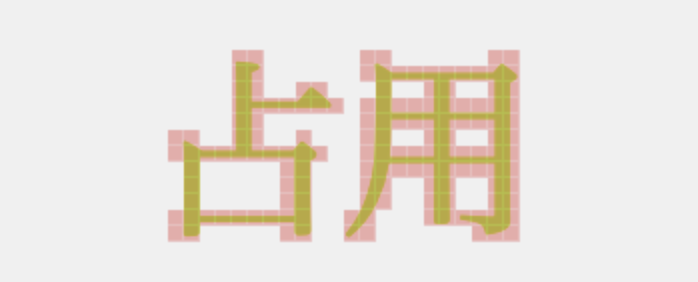
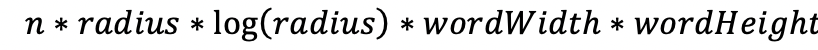
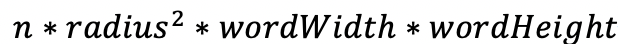
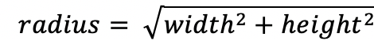

# 词云布局解析

## 什么是词云

词云，又称标签云，是指由单词或者标签组成，并且形似云朵的一种可视化展现形式。作为一种主要用作文本分析的工具，词云的可读性对于用户高效快捷的了解文本内容，掌握文本大体结构和概念是非常重要的。影响词云的因素有很多，从词云本身出发，宏观因素有词语的大小，颜色，字体以及词云的整体形状；微观因素有词语的选词，布局方式以及词语间间距。

## 词云分类

从时间维度上可以划分出动态词云（含有时间维度）以及静态词云。
针对词云布局又可以划分为无固定形状边界约束的词云和边界约束下制定形状的词云。

### 静态词云的布局

对于静态词云来说，各个词语的大小主要取决对词语的出现频率，对于静态词云的布局经历了如下几个阶段：

1. 逐行排列
   最初的词云布局是按照频率或者单词的次序进行依次排列而形成的逐行式词云形式，但是这种形式的词云并不美观，对于分析来说也是难以进行快速分析。
   为了改进这种布局方式，如何尽可能多的消除空白空间和限制单词的边界成为主要的优化手段。
2. 矩形框

最优化布局空间： Kaser 16，矩形框打包，电子设计自动化
标签云提供了标签使用统计信息的汇总。 它们通常以嵌入式 HTML 的形式发送到浏览器。 但是，适合于普通文本的显示机制并不是标签的理想选择，因为字体大小可能在一行上变化很大。 同样，典型的布局不考虑标签之间可能已知的关系。 本文提出了改进由内嵌 HTML 组成的标签云显示的模型和算法，以及使用嵌套表来实现考虑标签关系的更通用的二维布局的算法。 第一种算法利用排版和矩形包装中的先前工作，而第二组算法利用电子设计自动化中的先前工作。 实验表明，我们的算法可以有效地实现并且表现良好。
螺旋布局

3. 螺旋布局，可供用户灵活进行布局
4. 缝合雕刻

通过利用量身定制的接缝雕刻（一种完善的内容感知图像大小调整运算符）来创建保留语义的词云的新方法。 该方法可以通过反复从布局中删除从左到右或从上到下的接缝来优化词云布局。 每个接缝都是由基于高斯的能量函数确定的低能量区域的连接路径。 通过接缝雕刻，我们可以紧凑有效地打包词云，同时保留其整体语义结构。

### 可扩展词云布局

任意形状下的可扩展词云布局算法，它主要侧重于对词云布局美观性及多形式性的研究。任意形状下的可扩展词云布局算法对于给定的一系列的标签和一个任意形状的多边形，需要确定以下两个关键因素:

1. 多边形的规模
2. 在上述多边形范围内的词云布局。
   在这两个因素下，单词将按照从多边形左上角到右 下角的次序无重叠的依次布局，具体可由以下三个部分实现:
3. 首先，需制定一个 可以有效的识别和更新多边形中空白区域的数据结构。
4. 其次，运用填词算法将单词(用矩形框表示)插入到封闭的多边形中。
5. 最后，定义函数寻找多边形最优规模 S，其中最佳多边形的规模 S 是一个寻根问题，并且满足一定的方程 f(s)=0。
   正如前面提到的，该问题的实质为选择尽可能最小的多边形规模，使它可以紧密的容纳所给的所有有序的标签矩形框集。将这个问题化为求根问题，是为了搜索可能的规模空间来寻找可能的解决方案。

## wordcloud.js

### 布局算法

wordcloud.js 首先对 canvas 进行网格分割，记录格子是否被占用，然后对展现列表进行遍历，对每个词语进行：

1. 计算词语的字体大小，使用 measureText 计算宽高
2. 以中心点半径为 0 开始，直到半径为最大值，获取圆上多个点（半径为 0 时，取中心点；半径不为 0 时，取 r \* 8 个点，根据角度均匀分布）
3. 对圆上的每个点，判断是否有足够的格子（圆上的点作为中心点，根据词语的占用格子数判断实际格子的占用信息是否全部可用）可以放下这个词语，如果有，更新格子的占用信息。
   

### 复杂度分析

规定：展现词语数目为 n，canvas 长 width，宽 height，词语的长为 wordWidth，宽为 wordHeight，划分的格子长宽为 gridSize
计算过程的伪代码如下：

```js
const globalOccupied = [width / gridSize][height / gridSize]; // 格子占用信息

// 处理一个词语
function processWord(word) {
  const info = getWordInfo(word); // 获取词语占用的格子信息
  while ((radius = maxRadius)) {
    // 从最大半径开始，最大半径为Math.sqrt(width*width + height*height)
    const points = getPointsAtRadius(radius); // 获取当前半径下的点
    const ifWordFit = points.some((ps) => testWordFit(ps, info)); // 对每一组点进行判断，是否能放下当前词语
    if (ifWordFit) {
      updateGlobalOccupied(word); // 更新格子占用信息
    }
    radius--;
  }
  processWord(nextWord); // 处理下一个词语
}

processWord(firstWord);
```

则如果不开启词语缩放整个的复杂度为：

开启词语缩放整个的复杂度为：



## Echarts wordcloud

Echarts wordcloud 底层使用了 wordcloud.js，在上层对展现列表先进行了倒序排序，以保证权重大的词语在图表中心（位置+字体大小两种编码共同作用）。

## 词云性能优化方向

1. 优化布局算法，减少复杂度
   wordcloud.js 的复杂度相对较高，在一些步骤是有性能优化的空间。例如在选取中心点时，使用复杂度更低的选取算法。
2. GL 布局
   使用更粗粒度的布局，例如只将词语简化为一个矩形，使用矩形进行布局。只需要对矩形进行碰撞检测，而且能够引入 gl 进行计算，性能会得到提升。
   同时，简化词语为一个矩形会导致笔画简单的词语存在较多空间没有被使用，会导致显示的词云不够紧凑。
